# 大规模 RDMA 分布式连接中的倾斜感知负载均衡

## 摘要

大规模分布式连接需要高强度的数据交换和并行处理。RDMA 降低了远端访问、数据交换和 CPU 开销，显著缓解了连接执行中的通信瓶颈；但在大规模输入和连接键倾斜下，少数热点键仍会产生大量连接工作量和结果输出，使计算工作和输出压力集中到少数节点，并形成由过载节点主导的执行长尾。因此，大规模 RDMA 分布式连接中的关键问题，是如何在控制开销受限的条件下，利用跨轮和执行期不断变化的负载信息持续生成有效的负载分配决策。

本文提出一种面向大规模 RDMA 分布式连接的倾斜感知负载均衡方法。核心思想是把跨轮历史验证、当前轮双侧负载识别和执行期剩余工作接管连成连续负载决策路径，使系统能够在输入规模增长、热点状态变化和运行时进度偏离时持续修正工作分配。在多线程仿真和统一通信、计算与控制面成本模型下，本文方法在 32x 到 128x 大数据区间相对全部对照形成稳定优势；相对 `Full-SkewJoin`、`AMJoin-style` 和 `OneSize-style` 三类代表性倾斜方法的几何平均相对完成时间比为 1.806 到 2.063。

**关键词：** 大规模分布式连接；RDMA；连接键倾斜；负载均衡；运行时再平衡

## 1 引言

大规模分布式连接是无共享数据库和数据分析系统中的核心执行环节。本文聚焦按相等连接键组织的二元连接：系统需要把两个输入关系中可能匹配的记录分配到相同或相关执行位置，再完成局部构建、探测、匹配计算和结果输出。随着输入规模增大，连接执行同时放大数据交换、局部计算和输出生成压力；当节点间负载不均时，整条查询管线的完成时间往往由少数最慢节点决定。因此，大规模连接不仅需要高吞吐的数据移动，也需要能够随数据分布变化保持均衡的任务分配 [8,38]。

RDMA 和高速网络正在改变分布式连接的成本结构。远端访问、数据重分布和数据交换的 CPU 开销下降后，通信瓶颈被显著缓解，局部计算、结果生成和负载分配在整体完成时间中的影响更加突出 [21-25,33,49]。RDMA 并不会改变连接键本身的频率分布；在大规模输入和连接键倾斜下，少数热点键仍可能产生大量连接工作量和结果输出，把执行压力集中到少数节点。通信成本下降后，这类由连接键倾斜造成的计算集中、输出集中和执行长尾更容易成为主要限制。

图 1 展示了连接键倾斜如何形成执行长尾。普通键通常产生可均匀分摊的连接工作；单侧热点会把某一侧输入处理、路由、构建或探测压力集中到少数节点，但匹配规模和输出压力仍取决于另一侧频率；当同一键在两侧都具有较高频率时，$f_R(k)$ 与 $f_S(k)$ 共同产生更大的匹配工作量和输出规模。此时，部分节点可能已经完成普通键任务，而过载节点仍在处理热点键对应的大量工作，整体完成时间由尾部节点主导。随着数据规模扩大，热点键上的连接工作和输出压力同步放大，简单增加执行节点或只依赖静态分区难以稳定消除这种长尾。

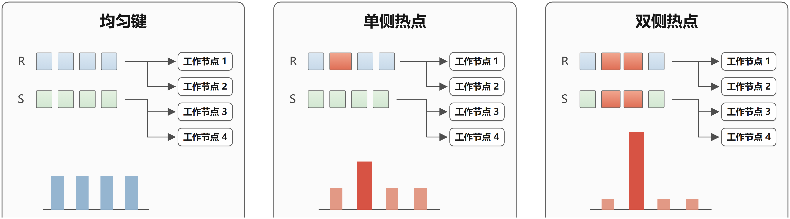

不同已有负载均衡方法分别通过执行前热点识别、分类路由、复制、任务拆分或运行时调整缓解部分倾斜问题 [1,2,4,5,10,32,47,48]。它们说明热点键不能被当作普通键处理，连接执行需要显式考虑键频率和任务放置。但是，大规模 RDMA 分布式连接要求负载决策在更低控制开销下持续利用变化的负载信息：重复或相似查询会积累或提供可验证的历史控制信息，当前轮输入需要在有限统计开销下获得可靠的双侧负载信息，执行期真实进度又会揭示初始计划后的剩余偏差。若负载决策只停留在单轮执行前统计、彼此割裂的执行前与执行期调整，或依赖预设拆分的任务展开上，系统仍可能同时产生重复规划、初始任务失准和运行时长尾等额外代价。

围绕这一目标，本文需要解决三个算法难点。

**历史状态如何安全复用。** 重复或相似查询中的热点统计和策略模板可能仍然有效，但输入分片版本、数据范围和资源上下文也可能发生变化；完全重建会增加控制面开销，直接沿用历史计划又可能导致负载判断失真。因此，系统需要判断哪些历史证据仍可作为当前轮统计和规划输入，哪些范围必须重新识别，并在证据不足时回退到完整识别与计划重建路径。

**双侧工作量语义如何以有限开销恢复。** 连接工作量由两侧频率共同决定，局部候选或单侧频率不足以稳定判断当前轮热点状态和拆分需求；而完整统计所有键可能显著削弱 RDMA 下低开销执行的收益。因此，系统需要在候选规模、边界键遗漏风险、双侧确认成本和初始计划质量之间取得平衡。

**真实剩余工作如何在并发执行中安全调整。** 运行时快照可能过期，本地领取和远端接管可能并发发生；系统只能调整尚未领取的剩余工作，并必须保证任务范围不重叠、不遗漏、所有权唯一，同时避免协调开销吞噬负载均衡收益。

本文的核心洞察是：RDMA 环境下的倾斜负载均衡不应被视为一次性的执行前计划，而应建模为由跨轮历史利用、当前轮执行前规划和当前轮执行期调整连续驱动的负载分配决策过程。基于这一洞察，本文提出一种面向大规模 RDMA 分布式连接的倾斜感知负载均衡方法。基于历史验证的增量规划根据已提交历史状态判断稳定计划部分与待更新部分，按需请求边界保留驱动的双侧负载识别，并增量合成当前轮完整初始负载计划。边界保留驱动的双侧负载识别在有限候选规模下获得两侧频率、热点集合、状态组合、键级工作量和边界确认结果。快照驱动的剩余工作再平衡算法依据运行时真实进度选择候选供给节点，并把调整限定在尚未领取的剩余工作上，从而缓解初始计划误差、节点速度差异和运行时扰动造成的残余长尾。

本文在统一通信、计算和控制面成本模型下评估该方法。实验结果显示，本文方法在大规模输入和强倾斜区间相对静态热点分发、AM-Join 式热点分类和 dispatcher 式方法保持更低的模型估算完成时间，并在 32x 到 128x 区间超过普通分布式哈希连接；其中 `Standard Dist-HJ` 相对本文方法的相对完成时间比为 1.57 到 1.95。资源扩展、workload 形态变化、基于外部分布构造的 workload 和网络成本缩放实验表明主要排序保持稳定。机制对照进一步显示，历史验证能够降低重复规划开销，双侧识别在证据不足时触发回退以避免未经确认的负载事实进入初始规划，运行时再平衡能够缓解慢节点扰动下的剩余工作长尾。

本文主要贡献概括如下。

1. 本文提出基于历史验证的增量规划算法，通过分片版本和历史状态验证划分稳定范围与残余范围，复用仍有效的统计证据和策略模板，按需调用双侧负载识别，并在获得当前识别结果后合成完整初始负载计划；当验证失败或成本不合适时，该算法回退到完整识别与计划重建路径。
2. 本文提出边界保留驱动的双侧负载识别算法，通过保留边界候选、合并跨节点候选并补全两侧频率证据，识别当前轮热点状态、键级工作量和边界确认结果，为增量规划提供可靠的双侧负载语义。
3. 本文提出快照驱动的剩余工作再平衡算法，将快照用于候选供给节点选择，将任务所有权交由实时队列状态决定，并把调整范围限定为尚未领取的剩余工作；在初始任务边界覆盖输入范围的前提下，该算法在并发执行中保持任务互斥、范围覆盖和进度单调。
4. 本文设计了覆盖规模扩展、工作负载鲁棒性、机制对照、基于外部分布构造的 workload 和成本模型敏感性的实验评估。七方法矩阵显示，本文方法的优势主要出现在大规模和强倾斜区间；普通分布式哈希连接、`Bala-Join-style` 和 `Flow-Join-style` 在中小规模或轻量检测足够的配置下仍具有竞争力。

下文其余部分安排如下。第 2 节给出研究对象、系统假设和问题定义。第 3 节按主要负载均衡决策依据比较相关工作并明确本文差异。第 4 节给出基础连接执行层与负载均衡控制层的总体设计。第 5 节介绍基于历史验证的增量规划。第 6 节介绍边界保留驱动的双侧负载识别。第 7 节介绍快照驱动的剩余工作再平衡。第 8 节给出实验评估。第 9 节给出结论。
## 2 系统模型与问题形式化

### 2.1 系统与查询模型

本文研究 RDMA 互联的无共享分布式环境中，二元自然连接中的负载均衡。给定两个输入关系 $R(K,A_R)$ 与 $S(K,A_S)$，其中 $K$ 表示共同连接键，$A_R$ 和 $A_S$ 表示两侧关系各自的非连接属性，并满足 $A_R\cap A_S=\emptyset$。$K$ 可以是单个属性或复合属性；若原始关系存在除 $K$ 之外的其他同名属性，视为已经在进入本文模型前完成重命名。本文用 $R\bowtie S$ 表示基于共同属性 $K$ 的二元自然连接，连接键域定义为 $\mathcal K=\{key(r)\mid r\in R\}\cup\{key(s)\mid s\in S\}$。系统由 $N$ 个执行节点组成，每个节点拥有本地 CPU、内存和执行线程，并可以通过 RDMA READ、RDMA WRITE 和远端原子操作访问已注册的远端内存区域。本文不讨论多路连接、外连接或流式无界状态管理，而聚焦二元自然连接中由连接键分布不均引发的负载均衡问题。

连接结果按多重集合语义定义。为避免重复值元组导致责任域不清，本文把输入中的每条记录视为具有唯一实例标识，并令 $key(r)$ 表示记录实例 $r$ 在共同属性 $K$ 上的取值。标准连接输出为

$$
Out=R\bowtie S.
$$

这里 $Out$ 表示所有匹配记录实例对经过自然连接投影或物化后的结果多重集合。若系统输出完整记录实例对，则输出与后文定义的逻辑匹配责任域一一对应；若系统只输出投影属性，则多个不同记录实例对仍可形成相同值的重复输出。

RDMA 改变的是远端访问、控制信息发布和少量状态更新的成本结构，并不改变连接键本身的频率分布；因此，问题定义仍必须以连接键频率、连接工作量和任务分配为核心。

### 2.2 连接键倾斜与工作量模型

本文将连接键倾斜定义为：连接输入中不同键对应的记录频率显著不均，且这种不均会在输入处理、数据交换、局部状态维护、匹配计算和结果输出中放大为节点间执行代价差异。对任意键 $k\in\mathcal K$，令

$$
f_R(k)=|\{r\in R\mid key(r)=k\}|,\qquad
f_S(k)=|\{s\in S\mid key(s)=k\}|.
$$

键 $k$ 对应的逻辑连接对数量为

$$
J(k)=f_R(k)f_S(k),
$$

全局连接对数量为

$$
J=\sum_{k\in\mathcal K}J(k).
$$

$J(k)$ 刻画同键匹配规模和输出规模，是后续实验中 `join_pair_count` 的数学来源。只在一侧出现的键仍属于 $\mathcal K$，其另一侧频率为 0，因此 $J(k)=0$，这使单侧热点与无匹配键可以在同一频率模型下表示。$J(k)$ 仍不是完整执行代价，因为实际代价还取决于记录宽度、本地构建与探测、结果物化、网络传输和控制面操作。本文用 $W(k)$ 表示键 $k$ 的内在连接工作量，即由 $J(k)$、输入记录宽度、输出代价和本地处理代价共同诱导的键级工作量。数据路由、复制、键内拆分等策略相关估计代价记为 $Cost(k,a)$，其中 $a$ 表示候选执行策略。$Cost(k,a)$ 是执行前比较候选策略时使用的代理代价，最终优化目标仍是完整计划诱导的端到端完成时间。$W(k)$ 描述的是键本身诱导的工作量，$Cost(k,a)$ 描述的是候选策略 $a$ 下的策略相关估计代价，二者在本文中分开定义。

热点语义只由两侧频率状态决定。令 $\theta_R$ 与 $\theta_S$ 分别表示两侧关系上的热点阈值，本文采用阈值式热点定义：

$$
H_R=\{k\in\mathcal K\mid f_R(k)\ge \theta_R\},
$$

$$
H_S=\{k\in\mathcal K\mid f_S(k)\ge \theta_S\}.
$$

在具体实验或系统配置中，阈值可以写成 $\theta_R=\tau_R|R|$ 与 $\theta_S=\tau_S|S|$，其中 $\tau_R$ 和 $\tau_S$ 是两侧关系上的相对频率阈值，具体取值由实验参数或系统配置给出。由 $H_R$ 与 $H_S$ 定义键 $k$ 的两侧状态组合

$$
z(k)=
\begin{cases}
HH, & k\in H_R\land k\in H_S,\\
HC, & k\in H_R\land k\notin H_S,\\
CH, & k\notin H_R\land k\in H_S,\\
CC, & k\notin H_R\land k\notin H_S.
\end{cases}
$$

其中，$HH/HC/CH/CC$ 描述的是键在两侧关系中的热点成员关系，不是最终执行代价或固定执行路径。$W(k)$ 较大不能反向改变 $H_R/H_S$ 或 $z(k)$ 的定义；最终计划需要同时考虑热点状态、内在连接工作量和候选策略代价。

### 2.3 任务分配与节点负载模型

给定一个合法执行计划，连接工作会被组织成一组逻辑任务

$$
\mathcal Q=\{q_1,\ldots,q_m\}.
$$

初始计划将一个或多个键的内在工作量 $W(k)$ 组织、拆分并映射为逻辑任务；结合节点环境、数据放置和具体执行策略后，得到任务在节点上的估计代价 $w_i(q)$。因此，第 2.2 节中的键级工作量与本节的任务代价具有如下层次关系：$f_R(k),f_S(k)\rightarrow J(k)\rightarrow W(k)\rightarrow q\rightarrow w_i(q)\rightarrow L_i$。

任务 $q$ 可以对应一个普通键分区、一个热点键上的拆分片段，或执行期进一步划分出的尚未领取工作。令 $x_{q,i}\in\{0,1\}$ 表示任务 $q$ 是否由节点 $i$ 执行，$w_i(q)$ 表示该任务在节点 $i$ 上的估计代价。节点 $i$ 的连接负载可抽象为

$$
L_i=\sum_{q\in\mathcal Q}x_{q,i}w_i(q).
$$

节点负载差异是执行长尾的直接来源，但本文最终关心的是查询端到端完成时间。本文用 $T_{\mathrm{e2e}}$ 表示包含本地计算、网络传输、结果输出和必要控制开销的端到端完成时间；第 8 章给出统一成本模型和模型估算口径。在第 2 章中，$L_i$ 只作为解释节点间不均衡和长尾的抽象量。

### 2.4 问题定义与正确性约束

本文把负载分配决策分为两部分：执行前初始计划 $P$ 和执行期调整策略 $\rho$。当前轮双侧负载识别输出负载描述 $\Phi_t=\langle H_R,H_S,z(k),\mathcal W(k),RecognitionSummary\rangle$，其中 $\mathcal W(k)$ 表示机制2返回的键级工作量点估计或置信区间；历史验证输出已确认的历史规划状态 $HV_t$。执行前规划可写为 $P_t=\Pi(HV_t,\Phi_t,Cost(k,a),ResourceContext_t)$，其中 $P_t$ 决定初始任务组织、拆分参数和任务归属。$\rho$ 仅能依据截至当前时刻已经观察到的执行状态，对尚未领取且满足可接管条件的工作进行调整。

令 $\Omega$ 表示由唯一记录实例对组成的逻辑匹配责任域：

$$
\Omega=
\{(r,s)\mid r\in R,\ s\in S,\ r.K=s.K\}.
$$

$\Omega$ 是记录实例对上的普通集合，用于描述每个逻辑匹配对的执行责任；$Out$ 是对 $\Omega$ 中实例对执行输出投影或物化后得到的结果多重集合。若输出完整记录实例对，则二者一一对应；若输出投影属性，则不同实例对可能产生相同值的重复输出。任一合法计划必须把 $\Omega$ 划分为若干最终任务责任域 $\Omega_q$，并保证每个逻辑匹配对由且仅由一个最终任务负责。本文研究的问题可以概括为

$$
\min_{P,\rho} T_{\mathrm{e2e}}(P,\rho).
$$

该目标受到三类约束。第一，输出正确性要求方法产生的输出与标准连接结果按多重集合语义等价：

$$
Out_{P,\rho}=Out.
$$

第二，任务责任域必须完整覆盖且不重复。记 $\dot{\bigcup}$ 为互斥并，则有

$$
\dot{\bigcup}_{q\in\mathcal Q}\Omega_q=\Omega.
$$

同时，每个最终任务只能由一个节点执行：

$$
\sum_{i=1}^{N}x_{q,i}=1,\qquad \forall q\in\mathcal Q.
$$

第三，运行时调整只能作用于尚未领取且满足可接管条件的工作；已经领取但尚未完成的工作不重新进入可调整范围。输入记录可以因路由、复制或拆分被多个节点读取，但同一逻辑匹配对只能由一个最终任务负责，且同一最终任务不能被多个节点重复执行。具体如何表示可接管范围、如何安全领取任务以及如何保持并发下的唯一所有权，由第 7 章展开。

### 2.5 适用假设

本文方法同时面向单次连接查询和重复或相似的连接查询。历史控制信息是可选输入，而不是正确运行的必要前提；当历史信息不存在、不可用或与当前输入不匹配时，系统仍应依据当前输入完成负载识别和任务规划。只有当输入分片或数据范围具备可验证的版本、快照或等价身份时，历史控制信息才能被安全复用并带来增量规划收益。历史信息的验证、复用和回退由第 5 章讨论。

执行期调整要求初始任务边界能够被定位和继续切分，且接管节点能够访问执行所需的数据或状态。本文的核心正确性边界是连接输出语义、任务覆盖和唯一输出责任；节点故障后的任务恢复不属于本文核心保证范围。当前轮双侧负载识别由第 6 章讨论，完整初始负载计划由第 5 章在合并历史证据、识别结果和资源上下文后生成，运行时剩余工作再平衡由第 7 章讨论。

## 3 相关工作

本文按通信环境组织相关工作，第一层区分传统消息通信环境和 RDMA 通信环境。传统环境下，相关方法主要围绕执行前如何形成初始负载，以及执行期失衡后如何调整展开；RDMA 环境下，相关工作则进一步分为数据访问与交换路径优化，以及直接改变任务分配的运行时负载协作。这样的组织方式既保留通信环境差异，也避免把 RDMA 数据路径优化强行解释为执行前负载规划。

本文关注二元自然连接中的连接键倾斜，因此相关工作比较的核心不是某个系统是否使用更快通信，而是已有方法如何利用负载信息、改变负载决策、适应执行阶段变化，以及能否把数据量、双侧频率诱导的键级内在连接工作、任务责任和执行期剩余工作放入同一条负载决策链。

### 3.1 传统网络环境下的分布式连接负载均衡

**执行前的倾斜识别与初始负载规划。**执行前负载均衡的共同模式是：在连接开始前观察数据分布、统计摘要、物理布局或代价估计，并据此确定数据位置、键到节点的映射、连接策略和初始任务归属。按照主要决策对象，相关方法主要沿数据划分与放置、热点分类与选择性复制、键内连接工作拆分三条路线展开。

数据划分与放置方法通过调整输入记录、分区或数据页的位置，降低数据交换、I/O、复制或跨节点访问。哈希重分布、shuffle、exchange、broadcast、数据放置、连接策略选择和相关性感知划分等工作都体现了这一思路 [8,38]。NOCAP 等相关性感知分区工作说明，输入记录数不足以刻画连接代价，连接相关性和内存预算会影响分区后的 I/O 成本 [38]；拓扑感知连接则说明，相同数据量放在不同节点或网络位置时，访问与通信成本也可能不同 [45]。这类方法能够减少无效数据移动，但其负载对象主要是数据页、分区大小或通信量；当连接键倾斜时，数据量均衡并不意味着由 `J(k)=f_R(k)f_S(k)` 刻画的逻辑匹配规模均衡，更不等于键级内在连接工作量 `W(k)` 均衡。

热点分类与选择性复制方法针对不同键选择普通哈希、热点侧保留、轻侧复制或差异化路由。PRPD、SkewJoin、AM-Join、OneSize 等工作说明，连接键不能一律按照普通键处理；系统需要根据两侧频率、采样结果、内存条件或代价估计，选择不同的路由和复制方式 [1,2,4,10]。AM-Join 根据双侧频率结构区分单侧热点和双侧热点，并分别通过 Broadcast-Join 和 Tree-Join 处理输入路由压力与双侧热点匹配空间；OneSize 根据当前轮倾斜特征选择 skewed hash join dispatcher。这类方法打破了“所有键使用同一分发规则”的限制，尤其适合处理单侧热点造成的输入处理和路由压力。不过，热点分类依赖执行前统计；复制策略可以改变输入到达位置和通信方式，但不能单独消除双侧热点带来的大规模匹配空间。

键内连接工作拆分方法把一个热点键内部的匹配空间分给多个执行位置。Tree-Join、AM-Join 中的双侧热点处理以及多执行节点处理单个热点键的方法，都在打破“一个键只能由一个节点负责”的约束 [1,2]。这类方法的算法核心不是简单识别热点，而是把单键连接空间转化为多个可并行责任区间，并在复制量、拆分粒度和多阶段执行之间折中。拆分数量、初始归属和执行次序仍主要由执行前频率与代价估计决定；节点速度变化、输出规模偏差和执行期剩余工作集中不会自动反馈到既有分配。

因此，传统执行前方法已经能够根据连接键语义形成初始负载分配，但它们通常把负载规划视为当前轮开始前的一次性决策。执行开始后的真实进度、节点速度变化和剩余工作状态，尚未与初始计划形成连续联系。

**执行期的自适应调整与长尾缓解。**执行期自适应方法在查询运行过程中观察真实基数、任务进度、节点速度或资源状态，并调整尚未完成的计划或任务。从运行时调整对象看，相关方法主要包括计划级重优化和任务级重新分配。

计划或阶段级重优化把查询划分为具有稳定边界的计划片段，在 shuffle、物化点或执行管线阻塞点收集真实统计，再用这些统计替换执行前估计，重新选择后续物理策略、并行度或计划片段。AQE 代表了这种思路，能够利用运行时统计修正错误的物理策略或阶段级估计 [48]。这类方法仍然保留优化器、算子和统计语义；但调整通常要等待阶段边界，作用对象是可重优化或可取消的未完成计划片段，而不是当前阶段内部正在消耗的细粒度连接责任区间。

任务或分区级重新分配则直接观察节点进度和任务状态，把未完成分区、任务或数据块迁移、拆分或交给空闲节点。SquirrelJoin 的惰性分区、Patch-Based Shuffling 的细粒度重分配、Salvaging Straggling Queries 的落后任务挽救，以及任务迁移和任务窃取方法，都体现了这种以运行时反馈修正初始分配的思路 [4,32,47]。它们比计划级重优化更灵活，能够在长尾暴露后继续转移工作；但这类方法常把任务视为通用调度单元，任务数量、分区数量或局部进度不一定等于连接键级真实工作量。

因此，现有自适应执行方法通常在计划语义完整性与运行时调整粒度之间作出不同取舍。计划级方法理解算子与统计语义，但调整边界较粗；任务级方法调整灵活，但通常缺少连接键频率、匹配空间、未领取责任域和唯一输出约束。它们能够说明运行时反馈对长尾缓解有价值，但还没有形成既理解连接工作语义、又能持续调整剩余责任区间的执行模型。

### 3.2 RDMA 环境下的分布式连接执行与负载协作

RDMA 通过单边远端访问、内核旁路、较低 CPU 开销和远端原子操作，降低了数据交换、远端状态读取和任务所有权协调的成本。已有 RDMA join、rack-scale in-memory join、高速网络查询处理、RDMA shuffle/exchange 和网络驱动的数据交换工作说明，高速互联可以改变分布式查询执行中的数据移动路径和系统瓶颈 [21-25,33,49]。随着数据路径成本下降，连接工作集中和运行时控制开销对查询长尾的影响更加突出。因此，RDMA 为更细粒度的负载调整提供了系统基础，但通信成本下降并不会自动消除热点键造成的匹配计算、结果输出和尾部等待。

**RDMA 数据访问与交换路径。**RDMA 数据路径工作的共同目标是降低给定执行计划下的数据移动和远端访问成本。相关工作主要从远端访问、数据交换和数据位置三个方面缩短执行路径：单边访问降低远端数据获取成本，零拷贝、内核旁路和通信计算重叠降低数据交换成本，远端内存、数据放置和拓扑感知执行放宽无共享架构中的数据位置约束。Rack-scale join、RDMA-aware shuffling、Zero-sided RDMA、Modularis、DSM-DB 和相关高速网络查询系统分别从这些角度改善高速网络查询执行 [21-25,33,49]。

从优化对象看，这类工作主要降低的是数据移动成本、远端访问成本和给定执行计划下的数据路径开销。而连接键倾斜负载均衡的核心变量是工作如何分配到节点，使最慢节点负载和端到端长尾下降。二者并不等价：即使输入字节、记录数或数据块被均匀划分，节点承担的匹配规模仍可能差异很大，因为键 `k` 的逻辑匹配对数量由两侧频率共同决定，即 `J(k)=f_R(k)f_S(k)`；完整负载规划还需要进一步考虑由输入处理、逻辑匹配、结果输出和局部处理压力共同形成的 `W(k)`。

因此，RDMA 改变了连接执行的单位通信成本，却没有改变键级内在连接工作量由双侧频率、匹配规模和输出压力共同诱导的事实。数据路径优化能够让既定数据交换和远端访问更快，但不能替代连接键级初始负载规划；大规模 RDMA 分布式连接仍需要显式决定哪些键、哪些匹配空间和哪些输出责任应分配给哪些执行节点。

**RDMA 倾斜处理与运行时负载协作。**RDMA 运行时负载调整通常包含状态获取、供需匹配和工作所有权转移三个环节。空闲节点或调度方可以读取远端队列、进度、计数器或负载状态；系统再根据这些状态选择过载节点和空闲节点；最后通过远端队列、原子操作或窃取协议，把一部分工作交给新的执行节点。Flow-Join 和 Skew-resilient Query Processing for Fast Networks 直接面向高速网络中的倾斜连接处理，说明运行时热点检测、动态重分布和任务窃取可以缓解部分长尾 [5,26]。Wukong 等 RDMA 系统和状态管理工作则提供了另一类证据：远端状态读取、队列协作和细粒度调度可以在高速网络中以较低开销实现 [27,50]。

这些机制降低了远端状态获取和任务接管的成本，使细粒度运行时协作具备可行性。首先，状态获取通常暴露的是队列长度、任务数量、局部进度或资源状态，而不是连接键级真实工作量。不同任务可能具有不同匹配对数量、输出规模、数据访问成本、拆分成本和复制成本；队列长度或任务数量趋于均匀，并不意味着剩余任务总成本或节点负载均衡。其次，供需匹配多是当前轮、局部、反应式决策，主要回答“哪个节点可以接管哪个任务”，不负责执行前形成可靠的双侧负载计划。最后，通用所有权转移协议能够避免普通任务重复领取，却不天然定义自然连接中匹配空间怎样切分、尚未领取范围怎样表示、已声明范围怎样排除，以及同一逻辑匹配对怎样只输出一次。

因此，RDMA 已经使细粒度状态访问和任务接管成为可行操作，但“能够低成本重新指派或领取工作”不等于“知道应调整哪部分连接工作”。大规模倾斜连接需要的不是通用队列层面的任务数量均衡，而是以键级内在连接工作和责任区间为对象的运行时决策模型。

### 3.3 研究空白与本文定位

上述工作可以归纳为三个核心缺口。第一是负载表示不统一：输入字节、分区大小、通信量、任务数量、队列长度和运行进度都只能从某一侧面近似负载，不能稳定代表由双侧频率、逻辑匹配规模、结果输出和局部处理压力共同形成的连接工作。第二是负载决策在时间上不连续：历史证据、当前轮初始分配和执行期真实剩余工作往往属于不同决策层，缺少从“历史证据”到“当前轮初始计划”再到“执行期剩余责任区间”的可验证状态传递。第三是初始分配与运行时所有权不统一：执行前任务放置回答工作应放到哪里，执行期领取和切分还必须回答哪些工作尚未领取、哪些已经声明、哪些可以继续切分，以及怎样保证责任区间互斥和唯一输出。

由此得到本文关注的总结性问题：在 RDMA 降低数据访问和控制交互成本后，如何围绕双侧频率诱导的连接工作及其任务化责任区间，建立跨轮历史信息、当前轮初始分配和执行期剩余工作之间的连续决策过程，从而降低大规模倾斜连接的最大节点负载和执行长尾。

本文的定位是在 RDMA 环境中研究大规模二元自然连接的连接键倾斜负载均衡。基于历史验证的增量规划回答历史计划状态如何验证、稳定计划部分与待更新部分如何区分并增量更新为完整初始负载计划；边界保留驱动的双侧负载识别回答当前轮双侧负载事实如何可靠获得；快照驱动的剩余工作再平衡回答执行中哪些责任区间还能安全调整以及如何维护所有权。通过这种组织，本文把 RDMA 的低成本数据访问和状态协作能力与连接键语义、任务化责任区间和运行时长尾纠偏结合起来。

## 4 总体设计

### 4.1 总体算法架构与设计目标

本文将大规模 RDMA 分布式连接中的倾斜负载均衡组织为连接执行层和负载决策层。连接执行层支持哈希路由、轻侧复制、键内工作拆分和局部连接等基础执行机制，用于承载不同连接键状态下的物理执行；负载决策层负责决定何时使用这些执行机制、如何参数化并生成任务，以及执行期如何调整尚未领取的剩余责任区间。

如图 2 所示，`HH`、`HC/CH` 和 `CC` 等状态组合为负载决策层提供两侧热点状态语义。具体执行计划并不只由状态组合决定，而是由负载决策层结合键级内在连接工作、策略相关估计代价和资源上下文生成；连接执行层再按照计划使用相应基础执行机制。图 2 中，基于历史验证的增量规划与边界保留驱动的双侧负载识别是两个独立模块，二者通过 `RecognitionRequest` 与 `LoadProfile_t` 交换信息：前者验证历史状态、确定待确认范围并合成完整初始负载计划，后者返回当前轮双侧负载事实和边界确认结果。这样，跨轮历史证据、当前轮双侧连接工作和执行期真实剩余工作被组织为连续的任务分配决策。

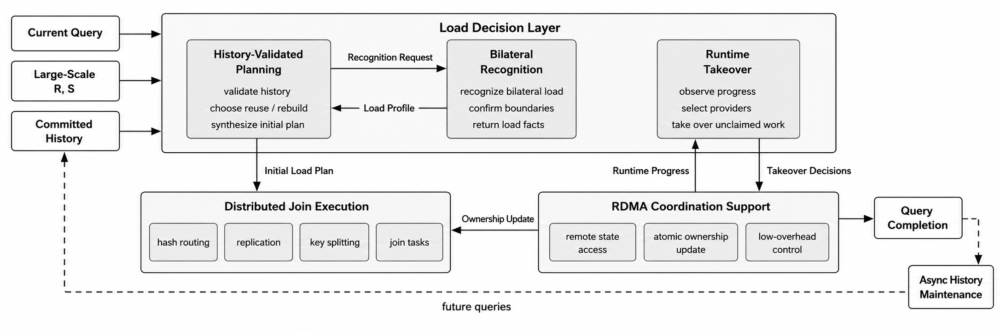

围绕该架构，本文设计目标包括三个方面。第一，降低重复或相似查询中的跨轮重复规划开销，使经过验证的历史统计证据和策略模板能够进入当前轮规划，并在证据不足时回退到当前轮完整识别与计划重建。第二，提高当前轮初始规划的可靠性，同时刻画连接键在两侧关系中的热点状态、键级内在连接工作和策略相关估计代价，避免仅依据局部摘要或单侧频率生成初始任务。第三，根据真实剩余工作缓解执行长尾，将调整对象限定为尚未领取且满足可接管条件的责任区间，在保持覆盖、互斥和唯一输出的条件下把尾部工作分配给空闲执行节点。本文所说的可接管工作，是指尚未被本地或远端领取，且边界可定位、可继续切分、数据或状态可访问、切分后输出范围互斥的剩余工作。

### 4.2 端到端负载决策流程

图 3 展示了本文方法的端到端负载决策流程。查询到达后，基于历史验证的增量规划首先判断已提交历史状态中哪些统计证据、策略模板和输入范围仍可用于当前轮；历史信息不可用或验证失败时，系统转入当前轮完整识别与计划重建。对于需要当前轮确认的范围，增量规划向边界保留驱动的双侧负载识别发出 `RecognitionRequest`，并接收 `LoadProfile_t`，其中包含两侧频率、热点集合、状态组合、键级工作量和边界确认结果。随后，增量规划将历史证据、当前识别结果和资源上下文合并，合成完整初始负载计划。该计划包含路由方式、拆分参数、任务边界和初始归属，连接执行层按照该计划执行相应连接任务。

执行开始后，各节点按照初始任务推进连接执行，并持续产生进度信息。快照驱动的剩余工作再平衡算法根据已观察到的执行状态选择候选供给节点，只对尚未领取且满足可接管条件的剩余工作调整任务归属；已经被本地或远端领取的范围不再进入接管范围。当前查询完成并返回结果后，系统异步生成并提交下一版历史控制状态。历史状态在完整写入并通过发布条件后，才作为新版本对后续查询可见；该更新过程服务后续查询，不进入当前查询完成关键路径。

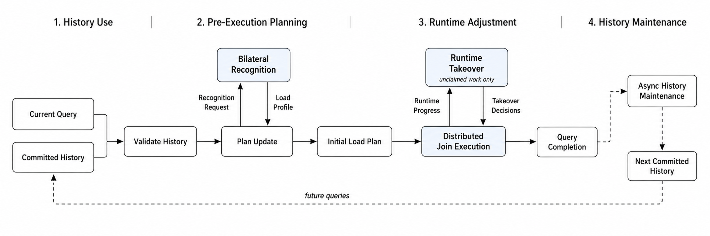

### 4.3 模块接口与工作边界

第 4.2 节描述了三个核心模块之间的协同关系。表 1 以语义级接口总结各模块的输入、职责与输出；其中“识别请求”对应 `RecognitionRequest`，“负载画像”对应 `LoadProfile_t`。表内采用中文名称以突出模块边界，具体字段、判定规则和并发领取协议在后续机制章节展开。

| 模块 | 主要输入 | 职责与输出 | 执行时机 |
| --- | --- | --- | --- |
| 基于历史验证的增量规划 | 当前查询、已提交历史状态、当前输入与资源上下文 | 验证历史、确定识别范围，发出识别请求并合成完整初始负载计划 | 执行前 |
| 边界保留驱动的双侧负载识别 | 识别请求、稳定统计和当前输入统计接口 | 完成双侧统计、状态判定、工作量估计和边界确认，返回当前轮负载画像 | 执行前按需 |
| 快照驱动的剩余工作再平衡算法 | 初始任务、可继续划分的任务边界和运行时进度状态 | 选择供给节点并调整未领取工作的所有权，生成运行时接管单元 | 执行期按需 |

基于历史验证的增量规划还包含查询后异步维护历史控制状态的路径。该路径根据本轮统计、计划信息和执行反馈生成下一版历史控制状态，完整写入并通过发布条件后供后续查询读取，不进入当前查询完成关键路径。

总体流程中需要区分三种工作表示。初始任务由执行前规划生成，描述初始归属、路由规则、拆分参数和可继续划分的任务边界。执行开始后，尚未被领取且满足可接管条件的部分形成可接管剩余范围。运行时再平衡从该范围中生成接管单元，并更新其工作所有权。

运行时接管单元不是执行前预生成的任务集合。再平衡只改变尚未领取工作的执行所有权，不改变连接键分类、逻辑输入范围和既定任务语义，并保持逻辑任务覆盖、责任区间互斥以及结果不重复、不遗漏。增量规划的异步历史维护路径只服务后续查询，不改变当前查询结果，也不计入当前查询完成关键路径。

## 5 基于历史验证的增量规划

### 5.1 问题与核心思想

重复或相似的二元自然连接查询常出现在批处理、周期报表和滑动窗口分析中。相邻查询的输入范围会变化，但连接键分布、热点状态和有效执行策略往往具有跨轮稳定性。如果每一轮都从零开始识别热点、估计键级工作量、选择路由和拆分方式，再生成初始任务，系统会在稳定负载形态上反复支付控制面开销。直接沿用上一轮计划也不可取，因为输入分片、过滤范围、资源上下文和边界候选都可能发生变化。

基于历史验证的增量规划将这一问题转化为可验证的计划更新问题。该算法不复用连接结果，也不复用上一轮物理任务或固定节点归属；它验证历史统计证据和策略模板，区分稳定策略覆盖部分、待更新部分和需要重建的部分，并在获得当前轮负载事实后合成完整初始负载计划。完整计划包括路由方式、拆分参数、任务边界和初始归属。历史不可用、证据不足或复用成本不合适时，算法退化为完整识别与计划重建。

这一设计的关键在于把“历史复用”限制在控制信息层。历史状态只提供可验证的负载证据、策略模板和参数规则；当前轮仍根据资源上下文重新实例化任务。当需要补充当前轮负载事实时，机制1通过 `RecognitionRequest` 获取待更新范围的 `LoadProfile_t`。第6章不生成计划，机制1也不需要理解第6章内部的候选保留和边界确认过程。

### 5.2 可验证历史规划状态

历史状态保存的是控制面证据和策略模板，而不是连接结果。本文将一个已提交历史版本抽象为

$
HV^{(v)}=\langle VersionMeta^{(v)},ShardState^{(v)},QueryControl^{(v)}\rangle .
$

其中，$VersionMeta^{(v)}$ 记录结构签名、源快照、分片版本向量和发布状态，用于判断历史状态是否属于同一类查询输入；$ShardState^{(v)}$ 保存分片级候选摘要、精确候选计数、可查询索引或带误差界的摘要，用于查询稳定分片中的候选键贡献；$QueryControl^{(v)}$ 保存历史热点证据、状态组合、键级工作量估计、策略模板、参数规则、执行反馈和置信度。查询 $q_t$ 读取的是某个已提交历史版本 $HV^{(v_t)}$，而不是与查询轮次一一对应的状态。正在构建或发布失败的历史版本不参与当前轮验证。

对关系 $X\in\{R,S\}$，当前轮输入分片集合 $D_X^t$ 被划分为稳定分片和残余分片：

$
D_X^t=U_X^t\cup\Delta_X^t,\qquad U_X^t\cap\Delta_X^t=\emptyset .
$

稳定分片 $U_X^t$ 的统计贡献可以进入历史验证过程，残余分片 $\Delta_X^t$ 必须进入当前轮识别范围。分片版本一致只是统计复用的必要条件；若统计是在过滤后生成，还需要验证过滤模板、分片覆盖范围和当前查询输入语义兼容。若稳定贡献只能提供上下界，且区间跨越热点阈值或当前规划所需的识别精度要求，则该键不能直接进入稳定策略覆盖部分，而应转入待确认集合。

机制1只在以下条件下使用历史状态：输入分片具有不可变内容或可验证版本；稳定分片对候选键的贡献可查询；历史策略仅作为模板而非物理计划；所有不确定情况都能回退到更完整的当前轮识别和计划重建路径。这些条件使历史状态成为可验证的规划输入，而不是隐藏的执行捷径。

### 5.3 计划更新模式

历史验证的目标不是证明上一轮计划可以原样执行，而是判断哪些统计证据和策略模板仍有合法复用依据。机制1匹配查询结构签名，比较当前分片清单与历史分片版本向量，并检查稳定统计是否完整可查、策略模板是否仍在有效范围内、状态年龄和置信度是否满足阈值，以及部分复用成本是否低于完整重建成本。资源上下文变化通常触发参数重算，而不是直接否定历史模板；只有当节点规模、内存条件或拓扑变化超出模板有效范围时，系统才降低复用等级或进入重建。

验证结果对应三种计划更新模式。`FULL_REUSE` 表示当前查询的输入范围和统计语义均被已提交历史状态完整覆盖，且不存在未解决边界键。此时机制1不发出识别请求，而是使用被当前输入分片、查询语义和历史版本完整覆盖并验证通过的负载画像，以及稳定策略覆盖部分，在当前资源上下文下重新实例化完整初始负载计划。

`PARTIAL_REUSE` 表示存在可验证稳定分片和可复用策略模板，同时存在变化分片、未知范围或待确认边界键。此时机制1保留稳定策略覆盖部分，把残余输入范围和待确认关系侧键组织为 `RecognitionRequest`，并在获得 `LoadProfile_t` 后更新受影响规划决策。

`REBUILD` 表示不存在可用历史版本、结构签名发生实质变化、分片版本无法比较、统计语义不兼容、稳定贡献不可查询，或部分复用成本已接近完整识别。此时机制1放弃历史策略覆盖，发出覆盖完整输入的识别请求，并从当前轮输入重建完整初始负载计划。

为了表达关系侧复用边界，机制1维护

$
K_{reuse,X}\cap K_{check,X}=\emptyset,\qquad X\in\{R,S\}.
$

$K_{reuse,X}$ 表示关系 $X$ 侧经验证可复用统计证据的显式键集合，$K_{check,X}$ 表示已经暴露但仍需当前轮确认的键集合。$\Omega_{residual}$ 表示需要重新执行候选发现与统计确认的输入范围。由于同一连接键可能在一侧可复用、另一侧仍需确认，机制1不能仅凭单个全局键集合推出当前轮热点状态或连接策略。

以 `PARTIAL_REUSE` 为例，上一轮对应的历史状态覆盖四个已提交输入分片，当前轮 $q_t$ 中三个分片版本未变，一个分片发生变化。键 $k_1$ 在稳定分片中的双侧频率精确可查，历史模板显示它持续适合键内工作拆分；键 $k_2$ 的历史频率区间接近热点阈值，需要当前轮确认。若当前执行节点数从 32 变为 48，机制1保留 $k_1$ 的稳定策略覆盖，但不会复用上一轮的拆分数量和节点归属；变化分片和 $k_2$ 进入 `RecognitionRequest`。返回当前轮负载事实后，机制1重新计算参数、任务边界和初始归属，并与默认哈希路径合并为完整初始负载计划。

### 5.4 增量规划算法

机制1通过固定接口获取当前轮负载事实。识别请求按语义分组写为

$
\begin{aligned}
RecognitionRequest
=\langle &Scope,Evidence,Budget,\\
&StableStateRef,HistoryValidationSummary\rangle .
\end{aligned}
$

`Scope` 描述识别模式和识别范围；`Evidence` 描述可复用和待确认统计证据；`Budget` 描述识别阈值、回查预算和候选充分性要求；`StableStateRef` 指向可查询的稳定分片统计；`HistoryValidationSummary` 记录版本比较、摘要完整性、状态年龄、置信度和回退原因。历史策略模板保留在机制1本地，用于生成候选策略，不交给负载识别过程解释。

当前轮负载描述记为

$
\begin{aligned}
LoadProfile_t
=\langle H_R,H_S,z(k),\mathcal W(k),RecognitionSummary\rangle ,
\end{aligned}
$

其中 $\mathcal W(k)$ 是当前轮键级工作量的点估计或保守区间。`LoadProfile_t` 还可附带候选集合、两侧频率或频率区间、边界确认和识别置信信息。稳定贡献与残余贡献如何合成当前轮频率事实由第6章负责；机制1只消费 `LoadProfile_t` 中已经确认的负载事实、置信信息和回退信号。

算法1给出增量规划的控制结构。伪代码中的 `Phi_t` 表示当前轮负载描述，即 `LoadProfile_t` 或 `FULL_REUSE` 下经验证可复用的历史负载画像。`LoadProfile_t` 可能包含热点键、边界确认键、候选普通键和候选充分性证据，并非所有返回键都需要非默认规划。因此，机制1根据状态组合、$\mathcal W(k)$、策略切换条件和资源上下文，从负载画像中选择显式规划键集合 $K_{explicit}=SelectExplicitPlanKeys(\Phi_t,Ctx_t)$。普通键不提前枚举，而是在执行时由默认哈希规则处理。为说明覆盖关系，令 $K_{all}$ 表示当前输入中出现的全部连接键，$K_{default}=K_{all}\setminus K_{explicit}$ 表示默认路径覆盖的逻辑补集。$K_{all}$ 和 $K_{default}$ 只用于正确性论证，不要求系统扫描、去重或物化完整键域。二者满足

$
K_{explicit}\cap K_{default}=\emptyset,\qquad
K_{explicit}\cup K_{default}=K_{all}.
$

```algorithm
算法1：基于历史验证的增量规划
输入：查询 q_t，当前输入 D_R^t,D_S^t，当前资源上下文 Ctx_t
输出：完整初始负载计划 P_t

1. HV ← LatestCommittedHistory(q_t)
2. S ← ValidateHistory(HV, q_t, D_R^t, D_S^t, Ctx_t)
3. mode ← SelectUpdateMode(S)
4. if mode = FULL_REUSE then
5.     Phi_t ← ReuseLoadProfile(S)
6. else
7.     req ← BuildRecognitionRequest(mode, S, D_R^t, D_S^t)
8.     Phi_t ← RecognizeDualSideLoad(req)
9.     while IsInsufficient(Phi_t) and mode != REBUILD do
10.        (mode, req) ← UpgradeRecognitionScope(mode, req)
11.        Phi_t ← RecognizeDualSideLoad(req)
12.    end while
13.    if IsInsufficient(Phi_t) then
14.        return ReportRecognitionFailure()
15.    end if
16. end if
17. retry ← true
18. while retry do
19.     retry ← false
20.     if mode = REBUILD then Tpl ← ∅ else Tpl ← ValidatedTemplates(S)
21.     K_explicit ← SelectExplicitPlanKeys(Phi_t,Ctx_t)
22.     (L_pred^(0),B_remain^(0),Q_special) ← InitPlanningState(Ctx_t)
23.     r_total ← 0
24.     for (j,k) in Enumerate(SortDesc(K_explicit,\mathcal W(k))) do
25.         A^(j)(k) ← FeasibleStrategies(k,Phi_t,Tpl,L_pred^(j),B_remain^(j))
26.         while A^(j)(k)=∅ and r_total < R_max do
27.             (Q_special,L_pred^(j),B_remain^(j)) ← RepairOrReplan(k,Q_special,L_pred^(j),B_remain^(j),Ctx_t)
28.             A^(j)(k) ← FeasibleStrategies(k,Phi_t,Tpl,L_pred^(j),B_remain^(j))
29.             r_total ← r_total + 1
30.         end while
31.         if A^(j)(k)=∅ and mode != REBUILD then
32.             mode ← REBUILD
33.             Phi_t ← RecognizeDualSideLoad(BuildRecognitionRequest(REBUILD,S,D_R^t,D_S^t))
34.             if IsInsufficient(Phi_t) then return ReportRecognitionFailure()
35.             retry ← true
36.             break
37.         end if
38.         if A^(j)(k)=∅ then return ReportPlanningFailure(k)
39.         a_k^* ← SelectMinCost(A^(j)(k),Cost,L_pred^(j),B_remain^(j))
40.         Q_k ← GenerateTasks(k,a_k^*,Phi_t)
41.         (Q_k,L_pred^(j+1),B_remain^(j+1)) ← PlaceAndUpdate(Q_k,L_pred^(j),B_remain^(j),Ctx_t)
42.         Q_special ← Q_special ∪ Q_k
43.     end for
44. end while
45. DefaultRouteRule ← BuildDefaultHashRule(K_explicit,Ctx_t)
46. return AssemblePlan(Q_special,DefaultRouteRule,Ctx_t)
```

`ValidateHistory` 产生稳定策略覆盖部分、待确认部分、已验证策略模板和重建原因；`RecognizeDualSideLoad` 是第6章定义的双侧负载识别接口；`UpgradeRecognitionScope` 只能单调扩大识别范围或把模式提升为 `REBUILD`，因此不会在不同请求之间循环。进入 `REBUILD` 后，机制1清空历史策略模板，重新获取覆盖完整输入的当前轮负载画像，并从空的初始计划状态重新合成计划；这与 `REBUILD` 放弃历史策略覆盖的语义一致。显式规划循环只物化并处理 $K_{explicit}$；`DefaultRouteRule` 表示键不在显式规划表中即进入默认哈希路径，而不是对 $K_{default}$ 的物化枚举。`RepairOrReplan` 是有界保守修复过程，整个规划过程共享 $R_{\max}$ 次修复预算；每次修复采用预定义的资源节约型策略切换、复制或拆分预算收紧，或任务重放置，不隐藏无界回溯搜索。若尚未进入 `REBUILD`，规划失败触发完整识别与完整重建；若 `REBUILD` 下仍失败，则报告启发式规划失败，并由独立容量检查区分规划失败与真实容量不足。算法块保留增量规划的控制结构，资源感知策略选择和任务放置规则在下一节展开。

### 5.5 策略选择与任务放置

完整初始负载计划由机制1合成，但策略选择不能把每个键完全独立处理。复制预算、内存容量、通信预算和节点负载都是全局共享资源；若每个键只选择局部代价最低的策略，多个热点键可能共同耗尽资源或集中到少数节点。因此，机制1采用资源感知的顺序启发式：先按 $W(k)$ 从大到小处理显式规划键，再根据当前剩余资源和预测节点负载为每个键生成可行策略集合。

设 $L_{pred}^{(j)}$ 表示处理第 $j$ 个显式规划键之前已经放置任务形成的节点预测负载，$\mathbf B_{remain}^{(j)}=\langle B_{\mathrm{mem}}^{(j)},B_{\mathrm{rep}}^{(j)},B_{\mathrm{net}}^{(j)}\rangle$ 表示剩余内存、复制和通信预算向量；算法1中的 `B_remain^(j)` 即表示该多维资源状态。在处理键 $k$ 时，机制1构造当前资源状态下的可行策略集合 $\mathcal A^{(j)}(k)$，并选择

$
a_k^*=\arg\min_{a\in\mathcal A^{(j)}(k)} Cost(k,a\mid L_{pred}^{(j)},\mathbf B_{remain}^{(j)}).
$

`Cost(k,a\mid L_{pred}^{(j)},\mathbf B_{remain}^{(j)})` 是策略相关估计代价，用于比较当前剩余资源下不同候选策略带来的数据移动、复制、拆分、输出和局部处理压力。$\mathcal A^{(j)}(k)$ 中的策略不仅要满足状态组合和执行语义，还必须在当前内存、复制、通信和拓扑约束下至少存在一种合法初始放置。历史模板不决定策略可行性，只影响候选检查顺序、拆分参数初值，或在代价接近时提供稳定性偏好。每选择一个策略，机制1立即生成相应任务、完成初始放置，并更新为 $L_{pred}^{(j+1)}$ 与 $\mathbf B_{remain}^{(j+1)}$，再处理下一个键。

若负载证据不足以判断策略可行性，机制1扩大识别范围或进入 `REBUILD`。若负载证据充分但当前启发式状态下没有可行策略，机制1先尝试有界保守修复，例如收紧前面热点键的复制预算、切换更节省资源的已定义策略，或重新放置已规划任务。若修复预算耗尽且当前尚未处于 `REBUILD`，机制1转入完整识别与完整重建；若在 `REBUILD` 下仍失败，则报告启发式规划失败。该失败只说明当前部分计划和剩余资源状态不可行，不能直接证明系统容量不足；只有独立容量条件显示当前输入和资源无法支持任何已定义执行路径时，系统才报告容量边界。默认哈希路径是普通键或轻度倾斜键的语义正确默认路径，但不被视为所有高工作量键的容量后备方案。普通键通过默认哈希规则进入执行路径，显式规划键任务与默认路径规则共同构成完整初始负载计划。该计划还保留可继续划分的任务边界，为第7章的执行期接管提供责任区间。

### 5.6 异步历史维护

历史状态更新属于机制1的生命周期，但不属于当前查询完成关键路径。查询 $q_t$ 读取已提交历史版本 $HV^{(v_t)}$，其中 $v_t$ 表示该查询实际读取的历史版本号，而不是查询轮次；查询返回结果后，后台任务可能生成候选历史版本 $HV^{(v')}$，其中 $v'>v_t$。由于历史维护是异步过程，并非每一轮查询都必然成功发布新版本，后续查询也可能继续读取更早的已提交版本。

后台维护继承稳定分片状态，避免重复构建摘要；变化分片状态根据本轮残余统计重建，形成未来可查询的候选摘要、计数索引或频率区间；查询级策略模板根据本轮 `LoadProfile_t`、计划摘要、执行时间、输出规模和再平衡反馈更新。候选版本完整写入并通过发布条件后，系统才更新最新已提交版本指针，使其对后续查询可见。后台维护不缓存连接输出，不把本轮完整物理任务作为下一轮直接执行对象，也不为了维护历史状态阻塞当前查询完成。

### 5.7 正确性、开销与退化边界

机制1不改变二元自然连接语义。历史状态只影响当前轮初始路由、拆分参数、任务边界和初始归属，不改变连接谓词，不缓存连接结果，也不跳过基础连接执行。只要最终计划满足逻辑匹配责任域覆盖、任务互斥和唯一输出约束，历史判断的准确性只影响负载均衡质量，不影响输出多重集合正确性。

对连接键 $k$，令 $R_k$ 和 $S_k$ 分别表示两侧键值为 $k$ 的记录实例集合，该键的逻辑匹配责任域为

$
\mathcal D_k=R_k\times S_k .
$

计划合成把 $\mathcal D_k$ 划分为一组最终任务责任域：

$
\mathcal D_k=\biguplus_j \mathcal T_{k,j},\qquad
\mathcal T_{k,i}\cap \mathcal T_{k,j}=\emptyset,\quad i\neq j .
$

任务生成规则按构造保持责任域覆盖与唯一输出。算法1中的 `GenerateTasks` 和默认哈希规则不是任意生成任务，而是调用表5-1所列责任域划分规则；每条规则都返回其负责键域上的不交覆盖。

| 执行方式 | 责任域划分依据 | 唯一输出依据 |
| --- | --- | --- |
| 哈希路由 | 键到唯一初始执行位置的映射 | 每个键的默认责任域只有一个输出位置 |
| 轻侧复制 | 重侧记录区间划分 | 复制侧只提供匹配输入，不拥有独立输出责任 |
| 键内拆分 | $\mathcal D_k=R_k\times S_k$ 的互斥子块 | 每个记录实例对只落入一个子块 |
| 局部连接 | 键 $k$ 的完整责任域 $\mathcal D_k$ 归属单一任务 | 单一任务负责该键输出 |

对轻侧复制，若 $R_k$ 为重侧，则机制1按记录实例区间构造 $R_k=\biguplus_j R_k^{(j)}$，并令 $\mathcal T_{k,j}=R_k^{(j)}\times S_k$；$S_k$ 可以被复制到多个任务作为匹配输入，但每个重侧记录实例只属于一个 $R_k^{(j)}$，因此每个匹配对只在一个任务中输出。若每种任务生成规则都产生对 $\mathcal D_k$ 的不交覆盖，则显式规划键上的任务集合覆盖 $\bigcup_{k\in K_{explicit}}\mathcal D_k$，默认哈希规则逻辑上覆盖 $\bigcup_{k\in K_{default}}\mathcal D_k$。由于 $K_{explicit}$ 与 $K_{default}$ 互斥且并集为 $K_{all}$，两类任务责任域不重叠，并共同覆盖完整连接责任域。因此，计划输出与二元自然连接的多重集合语义一致。哈希路由、轻侧复制和键内工作拆分只改变数据到达方式与责任域组织方式，不改变 $\mathcal D_k$ 本身。输入记录可以被复制读取，但每个逻辑匹配对的输出责任只能归属一个最终任务责任域。第7章的运行时接管也只能在这些责任域的未领取区间上改变执行所有权。

统计正确性与计划正确性需要分开。输入范围互斥由 $U_X^t\cap \Delta_X^t=\emptyset$ 保证，它避免稳定分片贡献和残余分片贡献被重复计入；关系侧键集合互斥由 $K_{reuse,X}\cap K_{check,X}=\emptyset$ 保证，它只说明同一侧统计证据不会同时走复用路径和确认路径。真正的输出正确性来自任务责任域覆盖、互斥和唯一输出。历史状态若判断失准，可能选择较差的合法策略，导致初始负载不均或更多运行时再平衡，但不会删除责任域或重复分配责任域。不确定证据、统计缺失或候选不充分时，机制1必须转入补充识别或完整重建。

从开销看，机制1在 `FULL_REUSE` 下主要支付历史读取、版本验证和参数重新实例化成本；在 `PARTIAL_REUSE` 下，还需要双侧负载识别、策略代价评估和任务放置；在 `REBUILD` 下，开销退化为完整双侧识别加完整计划合成。是否尝试部分复用可由元数据估计的 $\widehat C_{partial}$ 与 $\widehat C_{rebuild}$ 比较决定。若边界确认失败或候选证据不足，机制1进入更完整的计划重建路径；若启发式重规划仍无法找到可行放置，则报告规划失败，并由外层容量检查判断是否触及容量边界。

令 $m$ 为当前输入分片数，$h=|K_{explicit}|$ 为显式规划键数量，$A$ 为每个键最多考虑的候选策略数量，$N$ 为执行节点数，$Q$ 为生成的逻辑任务数量，$Q_\rho$ 为单次修复重新评估或重新放置的任务数。历史验证主要与分片元数据和可查询稳定统计相关；显式键排序开销为 $O(h\log h)$，策略评估最多为 $O(hA)$。若任务放置使用最小负载堆或等价节点选择结构，单轮放置开销可写为 $O(Q\log N)$。考虑全局最多 $R_{\max}$ 次有界修复，本地计划合成开销可写为 $O(m+h\log h+hA+Q\log N+R_{\max}(A+Q_\rho\log N))$。第6章双侧负载识别成本单独分析；在 `PARTIAL_REUSE` 和 `REBUILD` 的端到端控制开销中，需要把识别成本与本节计划合成成本合并考虑。机制1的主要同步规划开销受分片数、显式规划键数、候选策略上界、修复次数和任务数控制，而不依赖对完整连接键域的物化枚举。

## 6 边界保留驱动的双侧负载识别

### 6.1 问题与核心思想

执行前规划需要可靠的当前轮负载事实。单侧频率、局部候选或输入字节数不能完整刻画连接负载，因为一个键的逻辑匹配规模由两侧频率共同决定，键级内在连接工作量还受到输入处理、结果输出和局部处理开销影响。边界保留驱动的双侧负载识别面向这一问题：在有限统计开销下，为机制1提供当前轮双侧热点状态、键级内在连接工作量和边界确认结果。

本章机制2的输出是当前轮负载描述 `LoadProfile_t`。它接收机制1给出的 `RecognitionRequest`，在指定识别范围内保留候选、补全两侧统计、确认热点集合和状态组合，估计 $W(k)$，并判断当前证据是否足以支持规划。第5章在计划合成阶段使用该结果确定最终路由方式、拆分参数、任务边界和初始归属。

### 6.2 边界保留候选表示与覆盖条件

候选保留的目标不是找出排序最高的若干键，而是避免遗漏可能改变热点状态或进入显式规划范围的边界键。对每个关系侧 $X\in\{R,S\}$，机制2接收 $K_{reuse,X}$、$K_{check,X}$、$\Omega_{residual}$ 和可查询稳定统计，并在残余输入中构建当前轮候选。候选来源包括历史边界键、待确认键、残余范围中的重频键，以及摘要误差上界可能跨越阈值或工作量界限的键。形式化地，关系侧候选集合写为

$
C_X=K_{reuse,X}\cup K_{check,X}\cup C_X^{residual}\cup B_X,\qquad X\in\{R,S\},
$

其中 $C_X^{residual}$ 来自残余范围中的当前轮候选，$B_X$ 表示依据摘要误差上界保留的边界候选。双侧确认使用统一候选集合

$
C=C_R\cup C_S .
$

热点集合采用阈值语义：$H_R=\{k\mid f_R(k)\ge \theta_R\}$，$H_S=\{k\mid f_S(k)\ge \theta_S\}$。但热点完整性并不足以支撑规划：两侧均低于热点阈值的 `CC` 键仍可能因为 $f_R(k)f_S(k)$ 较大而具有较高内在工作量，并被机制1纳入显式规划。因此，`RecognitionRequest.Budget` 还给出规划工作量界限 $\tau_W$，表示某个键是否必须在 `LoadProfile_t` 中显式物化的工作量覆盖界限；它不是执行策略切换阈值，也不表示该键必然进入 $K_{explicit}$。

覆盖条件不应被理解为逐个检查所有未枚举键。机制2随候选集合返回尾部覆盖证书，用摘要尾部上界、误差界和稳定统计引用证明未进入双侧统一候选集合 $C$ 的键均不需要显式返回。令

$
\begin{aligned}
\overline U_X^{tail}
&=\sup_{k\notin C}\left(U_X^{stable}(k)+U_X^{residual}(k)\right),\\
&\qquad X\in\{R,S\}.
\end{aligned}
$

表示未候选键在关系侧 $X$ 上的频率上界。再用第6.4节的内在工作量组成式构造单调上界

$
\begin{aligned}
\overline U_W^{tail}
&=F\left(\overline U_R^{tail},\overline U_S^{tail},\right.\\
&\qquad \left.b_R,b_S,b_{\mathrm{out}}\right).
\end{aligned}
$

这里要求 $F$ 对 $f_R$ 和 $f_S$ 单调不减，且 $c_{\mathrm{in}}$、$c_{\mathrm{probe}}$、$c_{\mathrm{out}}$ 等成本系数非负。$\overline U_R^{tail}$ 与 $\overline U_S^{tail}$ 可能来自不同的未候选键，因此把两个独立上界代入 $F$ 得到的 $\overline U_W^{tail}$ 可能偏松，但不会低估任一未候选键的内在工作量。偏松的界只会导致候选扩大或退化为完整识别，不影响识别正确性。

候选覆盖证书需要同时满足

$
\overline U_R^{tail}<\theta_R,\qquad
\overline U_S^{tail}<\theta_S,\qquad
\overline U_W^{tail}<\tau_W .
$

只有满足这些条件，未进入 $C$ 的键才能在逻辑上判为 `CC`，且其工作量上界低于机制1要求显式返回的范围。若无法证明该证书，机制2必须扩大候选、执行边界回查，或在 `RecognitionSummary` 中返回识别不充分；不能静默把未枚举键归入冷键或低工作量键。`top-h` 可作为实现中的候选压缩手段，但正式热点语义和覆盖条件均由阈值、工作量界限及尾部证书决定。

### 6.3 候选合并与双侧频率确认

候选集合形成后，机制2需要把单侧候选补全为双侧负载事实。一个键可能只在 $R$ 侧暴露为候选，也可能只在 $S$ 侧暴露；若不补全另一侧频率，系统无法判断其状态组合、匹配规模和输出压力。机制2对合并后的候选键集合执行双侧统计确认：稳定分片贡献来自历史精确计数、可查询索引或带误差界的摘要，残余分片贡献来自当前轮统计。

对候选键 $k$，机制2形成关系侧频率区间。稳定贡献和残余贡献分别给出 $[L_X^{stable}(k),U_X^{stable}(k)]$ 与 $[L_X^{residual}(k),U_X^{residual}(k)]$，当前轮频率区间为

$
L_X(k)=L_X^{stable}(k)+L_X^{residual}(k),\qquad
U_X(k)=U_X^{stable}(k)+U_X^{residual}(k).
$

当上下界相等时，频率为精确值；当摘要只能给出上界或误差区间时，机制2保留区间。热点状态采用统一判定规则：

$
L_X(k)\ge\theta_X\Rightarrow k\in H_X,\qquad
U_X(k)<\theta_X\Rightarrow k\notin H_X .
$

若 $L_X(k)<\theta_X\le U_X(k)$，则 $k$ 是关系侧待确认边界键，机制2需要根据 `RecognitionRequest.Budget` 中给出的识别精度要求执行补充统计、边界回查，或返回识别不充分。`Cert_R/Cert_S` 是双侧尾部覆盖证书的两个关系侧分量，它们共同证明统一候选集合 $C$ 之外的尾部不需要显式物化。只有当两侧频率证据足以确定 $H_R/H_S$ 成员关系和状态组合时，该键才能作为稳定负载事实返回机制1。

双侧统计确认还需要处理只在一侧出现的键。本文的连接键域包含两侧键值并集；只有当另一侧完整统计或可查询索引确认该键不存在时，机制2才能把另一侧频率置为 0，并得到 $J(k)=f_R(k)f_S(k)=0$。若另一侧只是摘要未报告该键，或局部节点尚未观察到该键，则频率仍可能未知，机制2需要继续查询、保留频率区间，或返回识别不充分。这类键可能仍影响输入处理或路由压力；机制2应保留其关系侧热点状态，而不能因为候选来源只在一侧出现就从候选语义中删除。

例如，键 $k_1$ 只在 $R$ 侧残余摘要中成为候选，若只观察该候选来源，它可能被误判为单侧热点。机制2把 $k_1$ 放入双侧候选集合 $C$ 后，还会查询 $S$ 侧稳定分片和残余范围的贡献；如果 $S$ 侧稳定贡献已经接近或超过 $\theta_S$，则 $k_1$ 的状态可能从看似 `HC` 变为 `HH`。该例说明候选来源侧只负责暴露风险，最终状态必须由两侧频率区间共同确定。

### 6.4 热点状态与内在工作量

在两侧频率确认后，机制2根据 $H_R$ 和 $H_S$ 生成状态组合：

$
z(k)=
\begin{cases}
HH,& k\in H_R \land k\in H_S,\\
HC,& k\in H_R \land k\notin H_S,\\
CH,& k\notin H_R \land k\in H_S,\\
CC,& k\notin H_R \land k\notin H_S.
\end{cases}
$

状态组合只由两侧热点集合成员关系决定，不能由 $W(k)$ 或策略代价反向修改。高工作量的 `CC` 键可以被机制1纳入特殊规划，但它的热点状态仍是 `CC`；同理，`HH` 状态也不直接决定最终拆分参数。

机制2同时估计键级内在连接工作量 $W(k)$。逻辑匹配对数量为

$
J(k)=f_R(k)f_S(k),
$

它说明输入记录数均衡并不等于匹配规模均衡。$W(k)$ 在 $J(k)$ 基础上进一步吸收输入处理、局部探测、结果输出和记录宽度等因素，作为当前轮负载事实返回机制1。策略相关估计代价 `Cost(k,a)` 不属于机制2输出；机制2只提供比较策略所需的负载事实和置信信息。

一个轻量的组成形式为

$
W(k)=
c_{\mathrm{in}}\bigl(f_R(k)b_R+f_S(k)b_S\bigr)
+c_{\mathrm{probe}}G\bigl(f_R(k),f_S(k)\bigr)
+c_{\mathrm{out}}J(k)b_{\mathrm{out}} .
$

其中，$b_R$、$b_S$ 和 $b_{\mathrm{out}}$ 表示输入和输出记录宽度，$G(\cdot)$ 表示本地构建、探测或枚举匹配对的处理项，$c_{\mathrm{in}}$、$c_{\mathrm{probe}}$ 和 $c_{\mathrm{out}}$ 是与系统成本模型对应的系数。该表达只刻画键自身诱导的内在工作，不包含复制、远端访问、具体放置和运行时接管等策略相关代价。若频率或系数存在不确定性，机制2可以返回 $W(k)$ 的区间 $[L_W(k),U_W(k)]$ 或相应置信信息，由机制1在策略比较中使用。

### 6.5 双侧负载识别算法与充分性判定

边界确认用于判断候选集合、频率证据和工作量估计是否足以支撑计划更新。`BuildBoundaryCandidates` 会在 `req.Budget` 允许范围内逐步扩大候选保留规模，并同步更新双侧尾部覆盖证书；只有预算耗尽后证书仍不成立，算法才返回候选覆盖不充分。若候选键的频率区间跨越热点阈值，或者尾部覆盖证书无法排除未候选键越过热点阈值或 $\tau_W$，机制2需要进行补充统计或精确回查。若稳定分片缺少可查询统计，或者边界回查成本超过完整识别成本，机制2应向机制1返回识别不充分和回退原因。

```algorithm
算法2：边界保留驱动的双侧负载识别
输入：RecognitionRequest req
输出：LoadProfile_t 或识别不充分

1. (C_R,C_S,Cert_R,Cert_S) ← BuildBoundaryCandidates(req)
2. C ← C_R ∪ C_S
3. if not ValidateCoverageCertificate(Cert_R,Cert_S,req.Budget) then
4.     return Insufficient("candidate coverage")
5. end if
6. I ← CompleteTwoSideIntervals(C, req)
7. B ← FindBoundaryKeys(I, req.Budget)
8. while B ≠ ∅ and WithinLookupBudget(B, req) do
9.     I ← RefineBoundaryIntervals(I, B, req)
10.    B ← FindBoundaryKeys(I, req.Budget)
11. end while
12. if HasUnresolvedHotBoundary(I) then
13.    return Insufficient("hot boundary")
14. end if
15. (H_R,H_S,z) ← BuildHotStates(I)
16. W_profile ← EstimateIntrinsicWork(I, req.Budget)
17. if WorkConfidenceInsufficient(W_profile, req.Budget)
18.    and not AllowConservativeInterval(req.Budget) then
19.    return Insufficient("work confidence")
20. end if
21. return BuildLoadProfile(H_R,H_S,z,W_profile,RecognitionSummary)
```

识别充分性可以从三方面判断。第一，候选覆盖充分：所有可能改变 $H_R/H_S$ 成员关系或超过 $\tau_W$ 的键都已被枚举，未候选键则由 `Cert_R/Cert_S` 给出的尾部频率上界和尾部工作量上界排除。第二，双侧证据充分：进入规划视图的键具有足以确定状态组合的两侧频率或频率区间。第三，工作量证据充分：$W(k)$ 的估计区间满足 `RecognitionRequest.Budget` 给出的规划精度要求；若精度不足但机制1允许保守区间规划，机制2可以返回 $[L_W(k),U_W(k)]$ 并在 `RecognitionSummary` 中标记，否则返回识别不充分。

机制2返回的结果可写为

$
\begin{aligned}
LoadProfile_t
=\langle H_R,H_S,z(k),\mathcal W(k),RecognitionSummary\rangle .
\end{aligned}
$

其中，

$
\mathcal W(k)=
\begin{cases}
\widehat W(k),& \text{点估计满足精度要求},\\
[L_W(k),U_W(k)],& \text{采用保守区间规划}.
\end{cases}
$

`RecognitionSummary` 记录候选覆盖证书、尾部频率上界、尾部工作量上界、摘要来源、误差界、候选容量是否充分、频率区间、边界确认、工作量置信和回退原因。`LoadProfile_t` 不要求返回完整键域上的逐键结构：逻辑上，$H_R/H_S$ 是当前轮完整热点集合，因为未候选键已由覆盖证书排除；物化上，$z(k)$、频率区间和 $\mathcal W(k)$ 只需要对候选集合 $C$ 中显式返回的键给出。未候选键逻辑上属于 `CC`，且其工作量上界低于 $\tau_W$。机制1仍从 $C$ 中根据资源上下文和策略条件进一步选择 $K_{explicit}$，二者不能等同。

### 6.6 正确性、开销与识别边界

机制2的正确性目标是负载事实正确，而不是输出连接结果。热点状态正确性来自候选覆盖证书和双侧区间判定：若 `Cert_R/Cert_S` 证明 $\overline U_R^{tail}<\theta_R$ 且 $\overline U_S^{tail}<\theta_S$，未候选键不会进入 $H_R/H_S$；若所有候选键的频率区间均位于热点阈值同一侧，则返回的 $H_R$、$H_S$ 和 $z(k)$ 与当前轮阈值热点语义一致。若存在 $L_X(k)<\theta_X\le U_X(k)$ 且无法在预算内确认，机制2必须返回识别不充分，不能把该键默认为普通键。

工作量估计有效性与热点状态正确性分开。$W(k)$ 或 $[L_W(k),U_W(k)]$ 是由当前轮频率区间、记录宽度和成本系数诱导的键级内在工作量估计，不等同于真实执行时间。覆盖证书中的 $\overline U_W^{tail}<\tau_W$ 进一步保证未候选 `CC` 键不会超过机制1要求显式返回的工作量界限。若候选键的工作量区间过宽，且超出 `RecognitionRequest.Budget` 给出的规划精度要求，机制2在允许保守区间规划时返回区间和标记；在不允许保守规划时返回识别不充分。失败安全性要求机制2在候选覆盖、双侧证据或工作量置信任一条件不成立时显式返回不充分，不能让机制1在缺失另一侧频率、边界未确认或高工作量尾部无法排除的情况下生成确定计划。

令 $n_\Delta$ 为残余输入记录数，$c=|C|$ 为双侧候选数，$b$ 为需要精确回查的边界键数。机制2的同步开销主要来自残余范围统计、跨节点候选合并、覆盖证书构造、$c$ 个候选键的双侧稳定贡献查询，以及 $b$ 个边界键的精确回查。边界保留的价值在于把统计工作集中到可能改变状态或超过显式规划工作量界限的键上，而不是完整枚举所有键。其收益依赖于候选摘要质量、稳定统计可查询性、尾部上界紧度和热点边界稀疏性；当 $n_\Delta$、$c$、$b$ 或尾部证书成本接近完整输入规模，或者稳定统计不可查时，机制2应退化为更完整的双侧统计确认。

本章以 `LoadProfile_t` 作为稳定输出接口，向第5章提供候选覆盖、双侧频率、热点状态、键级工作量和边界确认结果。第6章与第7章之间的任务接口由第5章完成：机制1使用 `LoadProfile_t` 合成完整初始负载计划，并把可继续划分的任务边界交给运行时再平衡机制。

## 7 快照驱动的剩余工作再平衡算法

### 7.1 问题与目标

执行前计划只能根据历史证据、当前轮统计和资源上下文估计负载。连接执行过程中，节点速度、输出规模、远端访问延迟和任务实际代价仍可能偏离估计，导致部分节点提前空闲而其他节点仍持有较长尾部工作。快照驱动的剩余工作再平衡算法面向这一执行期长尾问题：在不重写初始计划的前提下，让空闲节点从其他节点尚未领取且满足可接管条件的剩余范围中获得工作。

机制3的算法对象不是完整键级工作量，也不是重新生成初始计划，而是初始任务执行过程中仍未被领取的责任区间。它利用快照降低供给节点选择成本，用实时队列状态决定任务所有权，并把调整限定在可接管剩余范围内。快照只回答“优先探测哪些节点”，任务所有权只由实时队列状态上的原子更新决定；已经被本地或远端领取的范围不再进入接管范围。

图 4 概括了机制3的三个核心环节：快照只提供候选供给节点视图，实时状态检查决定是否存在可接管尾部区间，原子更新完成接管单元的所有权转移。

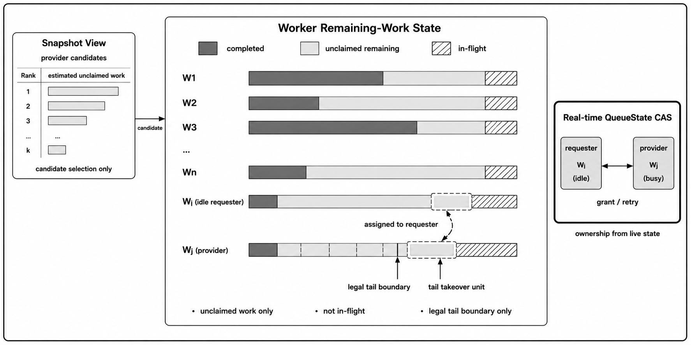

### 7.2 可接管剩余工作表示

第5章生成的完整初始负载计划把连接工作组织为逻辑任务，并为部分任务保留可继续划分的边界。对节点 $i$，机制3把这些工作表示为不可变逻辑任务序列；序列位置映射到第5章已经生成的互斥任务责任区间。运行时只改变序列中尚未领取部分的所有权，不改变逻辑任务覆盖关系。原子队列状态抽象为

$
QueueState_i=\langle Head_i,Tail_i\rangle .
$

$Head_i$ 表示本地领取已经推进到的位置，$Tail_i$ 表示当前剩余范围的尾部边界。一次查询执行 epoch 内，队列索引不循环复用，任务完成后也不重新入队，并保持如下单调性：

$
Head_i^{(t+1)}\ge Head_i^{(t)},\qquad
Tail_i^{(t+1)}\le Tail_i^{(t)},\qquad
Head_i^{(t)}\le Tail_i^{(t)}.
$

区间 $[Head_i,Tail_i)$ 中尚未被本地或远端领取、边界可定位、可继续切分、数据或状态可访问且切分后输出范围互斥的部分，构成可接管剩余范围。本地领取通过推进 $Head_i$ 获得工作，远端接管通过缩减 $Tail_i$ 获得尾部工作；二者作用于同一个可原子比较更新的 `QueueState_i`，或作用于等价的版本化队列描述符。一次成功的原子更新是任务所有权转移的线性化点。单调索引和不重新入队的约束同时排除了同一 $\langle Head_i,Tail_i\rangle$ 值在当前 epoch 内再次表示不同责任区间的 ABA 风险。

为了避免“队列为空但仍有活动工作”被误判为终止，每个节点维护活动计数

$
InFlight_i .
$

`InFlight_i` 记录已经领取但尚未完成输出提交的本地任务、已经接管但尚未完成输出提交的远端任务，以及正在尝试获取远端工作的活动。本地领取和远端接管都必须在队列范围被移除之前使对应活动对终止检测可见：一种实现是先原子增加 `InFlight_i`，再尝试推进 $Head_i$ 或缩减 $Tail_i$；若领取或接管失败，则撤销该活动。也可以使用包含活动状态的更强原子描述符，只要提供等价顺序保证。接管成功后，活动计数直到接管单元执行并提交输出后才清除。已经领取或接管但尚未完成的工作只通过 `InFlight_i` 参与终止判断，不重新进入可接管范围。

在近似等代价任务模式下，节点 $i$ 的可接管剩余工作量可写为

$
W_i^{rem}=Tail_i-Head_i.
$

在加权任务模式下，$W_i^{rem}$ 表示区间内估计工作量，需要通过边界定位函数确定实际切分位置。机制3不要求该估计等于完整剩余执行代价；它只用于选择供给候选和限制单次接管量。运行时接管单元是从可接管剩余范围中切分出的具体区间，接管成功后由请求节点执行，并从供给节点剩余范围中永久移除。

### 7.3 快照驱动的候选选择

如果每个空闲节点都直接轮询所有远端队列，控制面开销会随节点数和空闲请求数快速增长。机制3采用按需快照来提供候选视图：当节点本地没有可领取任务且存在空闲执行槽时，它读取当前已发布快照；若没有可用快照，或当前快照中的候选均已失效，则触发一次快照刷新。

快照采用版本化视图

$
Snapshot_s=\langle Version,ViewState,JFI,CandidateCount,Candidates\rangle .
$

其中，`ViewState` 取值为 `ACTIVE`、`WAITING` 或 `TERMINATED`。`ACTIVE` 表示当前存在至少一个满足可接管阈值的候选供给节点；`WAITING` 是全局已发布视图状态，表示没有可接管大块，但仍存在小粒度本地工作或活动任务；`TERMINATED` 表示所有队列为空且所有 `InFlight_i=0`，并经过必要重复确认。发布节点根据实时队列状态构建候选列表，只保留存在合法可接管尾部单元且其估计工作量不低于阈值 $B_{min}$ 的节点，而不是只检查节点剩余总量。Jain 公平指数可用于刻画快照中可接管剩余工作的集中程度：

$
JFI=\frac{(\sum_{i=1}^{N}W_i^{rem})^2}{N\sum_{i=1}^{N}(W_i^{rem})^2}.
$

$JFI$ 越接近 1，说明快照中可接管剩余工作越均衡；越接近 $1/N$，说明剩余工作越集中。当 $\sum_i W_i^{rem}=0$ 时，本文约定 $JFI=1$，但终止仍由 `ViewState` 与 `InFlight_i` 判断，而不是由 $JFI$ 推出。该指标只作为快照级摘要，不决定任务所有权，也不直接推导最优接管比例。

候选池规模用于限制探测开销。本文采用保守上界

$
K_{pool}=\min(active\_provider\_count,\max(1,\lceil\log_2 N\rceil)),
$

其中，$active\_provider\_count$ 表示当前快照中满足可接管阈值的供给节点数量。请求节点只在已发布候选池中做有限探测，并可根据自身标识和快照版本旋转候选访问起点，以减少多个请求节点集中竞争同一供给节点。快照用于指导“先探测谁”，不用于决定“是否获得任务”。

快照发布采用完整写入后原子切换的版本化语义。刷新者先在未发布位置构建完整 `Snapshot_s`，再通过原子更新发布版本；读取者通过版本前后校验获得一致视图。多个节点同时发现快照失效时，系统通过发布权或等价原子门控限制实际刷新者数量，避免刷新风暴。过期快照最多导致请求节点探测失效候选，不会决定任务所有权。

### 7.4 基于实时状态的原子接管

请求节点对候选供给节点进行确认时，必须读取供给节点的实时 `QueueState_i`。若实时剩余量低于 $B_{min}$，该候选被视为当前不可接管；若仍有足够剩余工作，请求节点计算单次接管量

$
C_{transfer}=\min\bigl(W_{rem},\max(B_{min},\min(\lceil W_{rem}/2\rceil,B_{max}))\bigr).
$

该规则要求 $0<B_{min}\le B_{max}$，用于限制单次接管量，避免一次接管过大造成新的长尾，也避免接管过小导致过多远端原子操作。近似等代价任务下，$C_{transfer}$ 表示接管任务数量，$\lceil W_{rem}/2\rceil$ 对应离散任务数量上的二分式接管；加权模式下先计算目标工作量，再由 `LocateTailBoundary` 量化到不超过目标值的最近合法边界。`LocateTailBoundary` 只能返回第5章预先保留的合法可划分边界：该边界满足责任域互斥、数据可访问和最小粒度约束，并且满足 $Head_i\le Tail_i'<Tail_i$；若允许接管全部未领取工作，也可以令 $Tail_i'=Head_i$。若剩余范围不存在合法可接管尾部单元，则 `LocateTailBoundary` 返回 `NONE`。

任务所有权由供给节点实时队列状态上的原子更新决定。近似等代价任务下，请求节点尝试把供给节点队列从 $[Head_i,Tail_i)$ 更新为 $[Head_i,Tail_i-C_{transfer})$；若原子更新成功，请求节点获得区间 $[Tail_i-C_{transfer},Tail_i)$。若失败，请求节点根据返回的最新队列状态重新判断该供给节点是否仍可接管，并在有限重试后转向下一个候选。

算法3给出了请求节点的一次快照引导接管过程。算法只展示论文机制需要的状态转换；快照槽、控制字布局和重试实现不影响所有权语义。

```algorithm
算法3：快照引导的尾部接管
输入：请求节点 r 的本地状态和已发布快照视图
输出：接管单元、WAITING、TERMINATED 或 NO_WORK

view ← ReadConsistentSnapshot()
if view.ViewState = TERMINATED then
    return TERMINATED
end if
if view.ViewState = WAITING then
    BackoffOrRefresh()
    return WAITING
end if
RegisterInFlight(r)
for p in BoundedCandidates(view.Candidates,K_pool,r) do
    for retry in 1..R_{\mathrm{cas}} do
        state ← ReadAtomicQueueState(p)
        if Remain(state) < B_min then
            break
        end if
        amount ← ComputeTransfer(state,B_min,B_max)
        tail' ← LocateTailBoundary(state,amount)
        if tail' = NONE then
            break
        end if
        if CASQueueState(p,state,<state.Head,tail'>) then
            unit ← [tail',state.Tail)
            ExecuteTakeoverUnit(unit)
            CommitOutput(unit)
            ClearInFlight(r)
            return unit
        end if
    end for
end for
ClearInFlight(r)
MaybeRefreshSnapshot()
return NO_WORK
```

本地领取和远端接管都必须通过同一个 `QueueState_i` 或等价版本化描述符完成。成功 CAS 是接管区间所有权转移的线性化点，并将供给节点剩余范围从 $[Head_i,Tail_i)$ 缩减为 $[Head_i,Tail_i')$。失败 CAS 说明队列状态已经被本地领取或其他远端接管改变，请求节点只能基于新状态重新判断。每个候选最多重试 $R_{\mathrm{cas}}$ 次，达到上限后转向下一个候选；所有候选失败后，算法清除活动计数并刷新视图或返回 `NO_WORK`。`NO_WORK` 只是单个请求节点本次有限候选探测未获得工作，不表示全局无工作。快照版本不参与单次任务所有权判断。旧快照最多导致请求节点探测到已经失效的候选并发生原子更新失败；只有实时 `QueueState_i` 的原子更新成功，任务所有权才发生转移。成功接管的区间不再发布为供给节点的可接管剩余范围。

### 7.5 终止、正确性与开销边界

全局终止不能由某个请求节点的局部探测失败推出。机制3的终止判断还依赖当前执行 epoch 已经封闭，即第5章生成的初始任务责任域已经完整进入当前执行，运行时再平衡只转移既有未领取责任区间，不创建新的逻辑责任域，也不在任务完成后重新插入范围。记该前提为 `EpochSealed`，则终止条件为

$
EpochSealed\land
\left(\forall i,\ Head_i=Tail_i\right)\land
\left(\forall i,\ InFlight_i=0\right).
$

终止检测采用固定观测顺序：确认 `EpochSealed` 后，先以 acquire 语义读取全部 `QueueState_i`；若任一队列非空，则不能终止；只有全部队列为空后，才读取全部 `InFlight_i`。当全部活动计数为 0，且版本或执行 epoch 未变化时，系统通过版本控制字原子发布 `TERMINATED` 视图；该状态在当前执行 epoch 中不可逆，不能被后续刷新覆盖。若没有可接管候选但仍存在小于 $B_{min}$ 的本地剩余工作或未完成活动，系统发布 `WAITING` 视图，由本地执行或后续刷新继续推进。

机制3的正确性来自四个方面。第一，实时队列状态保证唯一领取。本地领取和远端接管都必须更新同一队列状态，任一方先成功后，另一方基于旧状态的更新会失败，因此同一责任区间不会被两个执行者同时获得。第二，接管保持覆盖关系。若供给节点接管前的未领取范围为 $[Head_i,Tail_i)$，成功接管后尾部边界变为 $Tail_i'$，则原范围被划分为

$
[Head_i,Tail_i)=[Head_i,Tail_i')\uplus[Tail_i',Tail_i),
$

其中 $[Head_i,Tail_i')$ 继续留在供给节点，$[Tail_i',Tail_i)$ 成为请求节点的运行时接管单元，二者互斥且并集等于原未领取范围。第三，接管不改变输出语义。接管只改变尚未领取区间的执行所有权，不改变连接键分类、逻辑输入范围、任务覆盖关系和输出语义；成功接管的区间从供给节点剩余范围中移除，从而保持结果不重复、不遗漏。第四，终止判断是安全的。本地领取和远端接管都在队列范围被移除之前使执行活动对终止检测可见，输出提交后才清除活动计数；因此即使所有队列暂时为空，只要仍有活动工作，系统也不会发布 `TERMINATED`。

上述正确性建立在无故障边界之上：节点在领取、接管、执行和输出提交期间不失效，输出提交本身可靠。若要支持节点故障，需要引入租约、日志、重放、幂等输出或 epoch fencing 等容错机制；这些机制可以扩展所有权协议，但不属于本章核心算法。

机制3不声称无等待或无锁。其活性依赖于无故障执行、任务最终完成、快照最终刷新、原子操作具有公平进展，并且合法剩余工作最终被本地或远端执行线程调度。在这些条件下，$Head_i$ 单调推进、$Tail_i$ 单调收缩，活动任务最终提交，系统最终到达 `TERMINATED`。

从开销看，稳态执行节点只维护本地原子队列状态；空闲请求节点读取快照并围绕有限候选进行确认；快照刷新只在无可用视图、候选耗尽或等待过久时发生。一次请求最多探测 $O(K_{pool})$ 个候选，原子确认开销最多为 $O(K_{pool}R_{\mathrm{cas}})$。一次完整快照刷新需要读取全部节点的队列和活动状态，基础开销为 $O(N)$；若使用大小为 $K_{pool}$ 的堆筛选候选，候选构建成本为 $O(N\log K_{pool})$。$K_{pool}$、$B_{min}$、$B_{max}$、二分式接管量和 $JFI$ 都是性能启发式，不参与正确性成立条件。该设计把持续上报开销转化为按需控制开销，并把任务唯一领取的正确性放在实时原子队列状态上，而不是放在快照字段上。

## 8 实验评估

本节评估本文方法在 RDMA shared-nothing 成本模型下处理连接键倾斜等值连接的端到端效果、规模行为、机制贡献和适用边界。本节结果基于统一成本模型的模型估算完成时间；除非特别说明，跨方法结果仅在共同正确完成的配置上统计。跨方法比较使用相对完成时间比 $T_{method}/T_{ours}$，该值大于 1 表示本文方法的模型估算完成时间更短；只有 strong scaling 中同一算法随 worker 数变化的自我比较使用加速比。

### 8.1 实验设置与指标

实验使用多线程模拟执行器和统一成本模型。通信参数来自两节点 RDMA 微基准测量记录，计算、批量数据移动和控制路径开销按第 2 章的成本模型组合为模型估算完成时间。该指标覆盖连接执行、shuffle/replication 等数据移动以及进入当前查询关键路径的控制开销；查询返回后异步维护的历史状态不计入当前查询完成时间。由于本节报告的是模型估算时间，本文只比较不同负载规划、双侧识别和运行时再平衡策略在同一模型下的相对行为，不将其解释为物理部署中的端到端观测时间。

输入规模从 1x 到 128x，其中 1x 为 80 万条输入记录，128x 为 1.024 亿条输入记录；默认两侧记录宽度均为 256 字节，因此 128x 对应约 26.2 GB 逻辑输入。默认关系比例为 1:1，记录宽度实验覆盖 64、256 和 1024 字节等配置。Workload 由 `tiledhybrid` 生成器产生，控制 Zipf-like 倾斜、受控工作集中度、两侧热点相关性以及 HH/HC/CH/CC 状态组合。默认主线使用 mixed 状态组合，机制实验和鲁棒性实验补充边界候选、单侧热点、HH-dominant、慢节点扰动和 profile-scaled workload 等场景。

资源配置覆盖 4 到 64 个 worker，每个 worker 使用 1 个线程。不同实验可按协议采用不同的 shuffle partition 配置；其中 E1 输入规模实验固定为 20 个 shuffle partition，以保证该实验只改变输入规模。E2 的 strong scaling 固定输入并改变 worker 数，weak scaling 同时调整输入规模和 worker 数，以区分资源增加与输入增长的影响。主性能指标为模型估算完成时间；辅助指标包括 `load_cv`、`max_worker_time`、`worker_imbalance_ratio`、`control_path_overhead_ratio`、热点识别精度与召回、候选遗漏上界、边界回查时间、快照路径开销、CAS 成功率和无效探测数。

对比方法覆盖七种同问题域路线。`Standard Dist-HJ` 是统一实现中的普通分布式哈希连接，用于检验低倾斜或控制开销占比较高时普通路径是否更合适；`Full-SkewJoin` 代表静态热点分发；`AMJoin-style` 代表按单侧/双侧热点组织复制和拆分的等值连接负载均衡路线；`OneSize-style` 代表 skewed hash join dispatcher 参照；`Bala-Join-style` 和 `Flow-Join-style` 分别作为在线倾斜检测与高速网络倾斜处理路线的统一成本模型适配；`Ours` 为本文完整方法。所有方法使用相同 workload、相同成本模型和相同正确性检查口径。本文正文主图不报告 paired bootstrap 95% CI；跨方法结果以共同正确完成配置上的几何平均和必要的单点锚点呈现。小规模配置使用输出 pair 检查，大规模配置使用摘要一致性检查；timeout、capacity violation 和 oracle 行不进入几何平均相对完成时间比，只作为边界记录保留。

### 8.2 输入规模下的整体性能

输入规模实验回答本文方法在连接工作从中小规模增长到大规模时，是否仍能限制热点键造成的长尾。该实验固定 worker 数、记录宽度、关系比例、状态组合和 shuffle partition，只改变输入规模；图 5 同时展示模型估算完成时间、相对完成时间比、负载离散度和控制路径开销。

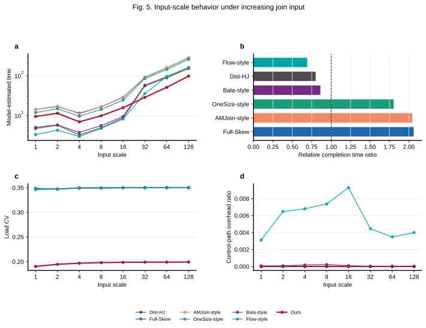

在 8 个输入规模配置上，`Full-SkewJoin`、`AMJoin-style` 和 `OneSize-style` 相对 `Ours` 的几何平均相对完成时间比分别为 2.063、2.044 和 1.806，且 `Ours` 在这些共同完成配置上均更短。图 5a 显示，随着输入规模增大，静态热点分发、热点分类执行和 dispatcher 选择的完成时间增长更快；图 5c 进一步说明这些差异与 worker 间负载离散度相关。大规模下的主要瓶颈不是单次数据移动，而是键级连接工作在节点间持续集中。

图 5 也给出了性能交叉点。`Standard Dist-HJ`、`Bala-Join-style` 和 `Flow-Join-style` 在 1x-16x 区间完成时间更短或接近，因为此时普通路径或轻量倾斜检测的控制开销较低；进入 32x、64x 和 128x 后，三者相对 `Ours` 的完成时间比分别升至 1 以上。例如 `Standard Dist-HJ` 在 32x、64x 和 128x 的相对完成时间比分别为 1.95、1.74 和 1.57。E1 因此支持的结论是：本文方法的优势主要出现在热点工作足以支配完成时间的大数据区间，而非所有输入规模上的无条件最快路径。

### 8.3 输入规模与并行度

规模扩展实验将资源变化从输入规模变化中分离出来。Strong scaling 固定输入规模并增加 worker 数，用于检查同一算法能否利用更多并行资源；weak scaling 将输入规模和 worker 数配对增长，用于观察每 worker 工作压力近似稳定时完成时间是否受控。图 6 展示 strong scaling 加速比、并行效率和 weak scaling 归一化完成时间。

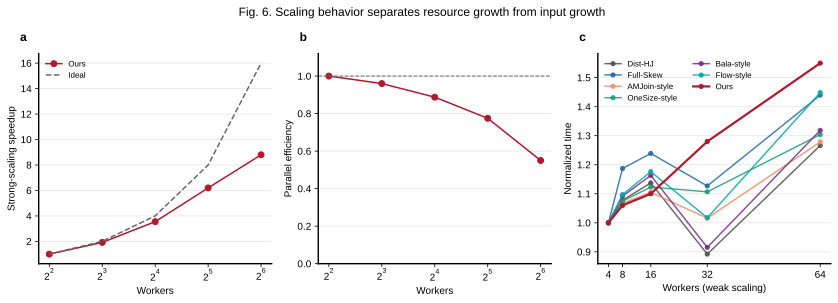

在 E2 的共同完成配置上，`Full-SkewJoin`、`AMJoin-style`、`OneSize-style`、`Standard Dist-HJ`、`Bala-Join-style` 和 `Flow-Join-style` 相对 `Ours` 的几何平均相对完成时间比分别为 2.923、2.845、2.672、1.733、1.677 和 1.250。`Ours` 对前五类方法在 10/10 个配置上更短，对 `Flow-Join-style` 在 9/10 个配置上更短。Strong-scaling 面板中，`Ours` 从 4 个 worker 增至 64 个 worker 时，同方法自比较加速比为 8.80x；由于资源增加 16 倍，对应并行效率约为 55%。该结果说明本文方法保持持续扩展能力，但并行效率随资源增加下降。

Weak-scaling 面板进一步说明，当输入规模随 worker 数增长时，`Ours` 的归一化完成时间最高为 1.55，表明输入与 worker 同比增加时完成时间增长被控制在 55% 以内，但仍存在调度、控制路径和负载离散造成的扩展损失。该结果与第 4 章的连续决策结构一致：机制1生成完整初始负载计划，机制2为受影响范围提供当前轮双侧负载事实，机制3只在执行期调整尚未领取且满足可接管条件的剩余工作。三者共同作用，使新增资源不仅增加节点数量，也增加可安全接管剩余责任区间的执行位置。

### 8.4 工作负载形态的影响

Workload 鲁棒性实验检查本文方法是否只适用于默认合成输入。该组实验改变自然倾斜、受控工作集中度、top-1% 工作占比、记录宽度、状态组合、表比例和两侧频率 rank correlation，分别放大键频率集中度、数据移动与输出字节压力、两侧输入不对称以及双侧热点事实的不确定性。

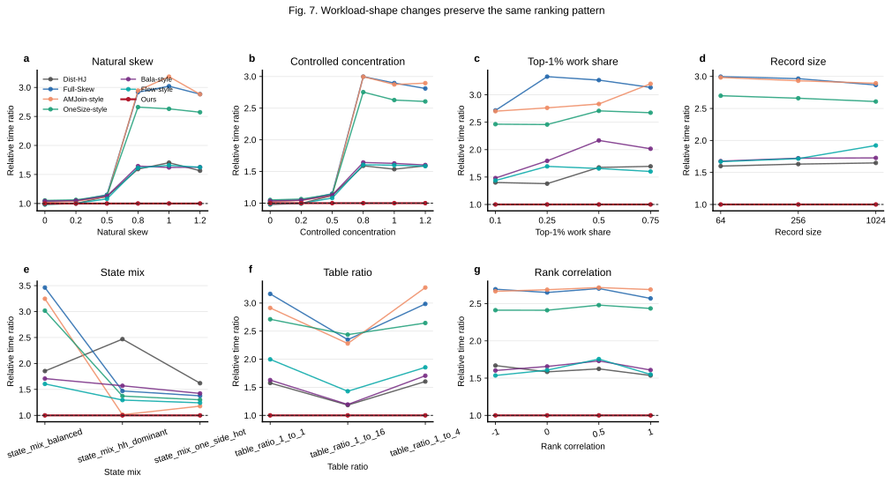

在 32 个 workload-factor 配置上，`Full-SkewJoin`、`AMJoin-style`、`OneSize-style`、`Bala-Join-style`、`Flow-Join-style` 和 `Standard Dist-HJ` 相对 `Ours` 的几何平均相对完成时间比分别为 2.244、2.203、2.062、1.524、1.476 和 1.446。`Ours` 对前三类倾斜感知对照在所有共同完成配置上更短，对 `Flow-Join-style` 和 `Standard Dist-HJ` 分别在 29/32 和 27/32 个配置上更短。图 7 的意义不是证明所有 workload 因素都带来相同幅度收益，而是说明不同因素触发的是不同负载不确定性：skew、controlled concentration 和 top-1% 工作占比改变热点集中度，record size 改变数据移动和输出压力，state mix 直接改变 HH/HC/CH/CC 构成，table ratio 主要改变两侧输入不对称、复制和数据移动压力，rank correlation 改变两侧热点是否落在同一组键上。

该实验也限定了结论范围。`Standard Dist-HJ`、`Bala-Join-style` 和 `Flow-Join-style` 在部分较轻倾斜或特殊比例下仍有竞争力，说明普通路径和轻量运行时检测仍是本文方法的重要边界。已有数据支持的判断是：在当前覆盖的倾斜、记录宽度、状态组合、表比例和相关性变化下，本文方法的排序趋势保持稳定；收益最大的位置出现在热点工作和状态组合足以触发双侧规划、复制或键内拆分的配置。

### 8.5 历史验证驱动的增量规划

机制1实验关注重复或相似查询中，历史规划状态是否能成为当前轮计划更新的有效起点。该组固定后续双侧识别和执行路径，只改变历史验证、模式选择、版本化增量统计和回退路径；图 8 展示完成时间、残余扫描与控制开销、后台维护成本、模式选择损失和相对 Oracle 的差距。

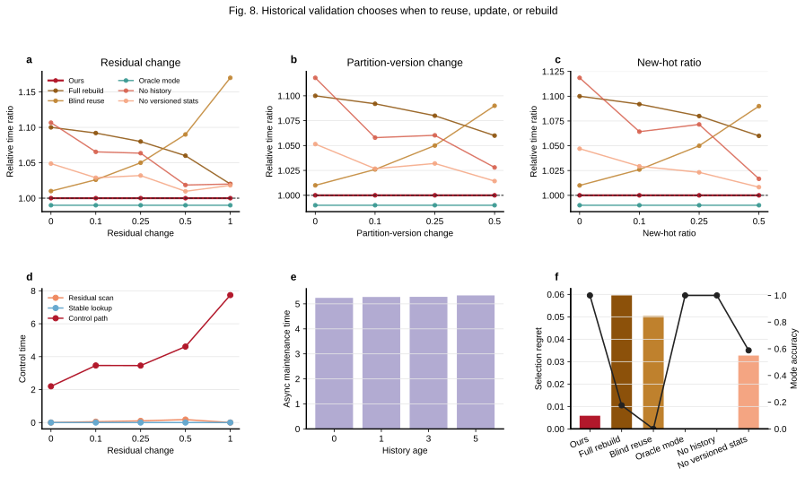

在 17 个共同完成配置上，`M1 Full Rebuild`、`Ours w/o History Reuse`、`M1 Blind Reuse` 和 `Ours w/o Versioned Incremental Stats` 相对完整方法的几何平均相对完成时间比分别为 1.075、1.060、1.059 和 1.028；`M1 Oracle Mode` 为 0.990，表示 oracle 模式选择比完整机制快约 1%。模式选择指标给出更直接的解释：完整机制的平均 `selection_regret` 约为 0.0059，而 `M1 Blind Reuse` 和 `M1 Full Rebuild` 分别约为 0.050 和 0.060；完整机制在这些配置中选择了 20 次 `PARTIAL_REUSE`、8 次 `FULL_REUSE` 和 6 次 `REBUILD`。由于每个配置包含多个连续查询轮次，模式选择次数按查询决策实例统计，因此高于共同完成配置数。

这一机制的边界同样重要。机制1复用的是经过验证的统计证据、策略模板和参数初值，而不是上一轮物理任务或节点归属；当新热点比例、分片版本变化、残余分片比例或历史年龄破坏验证条件时，系统应进入 `PARTIAL_REUSE` 或 `REBUILD`。因此，图 8 支持的是“历史验证驱动的模式选择能够接近 Oracle 并降低重复规划成本”，而不是“历史复用在随机 workload 下普适加速”。

### 8.6 边界保留驱动的双侧负载识别

机制2实验检验有限候选能否可靠恢复当前轮双侧负载事实。该组固定下游计划合成器和执行器，只改变候选保留、跨侧补全、边界回查和精确统计参照；图 9 展示机制触发 case、热点识别精度与召回、认证遗漏上界、false certification 和边界回查成本。

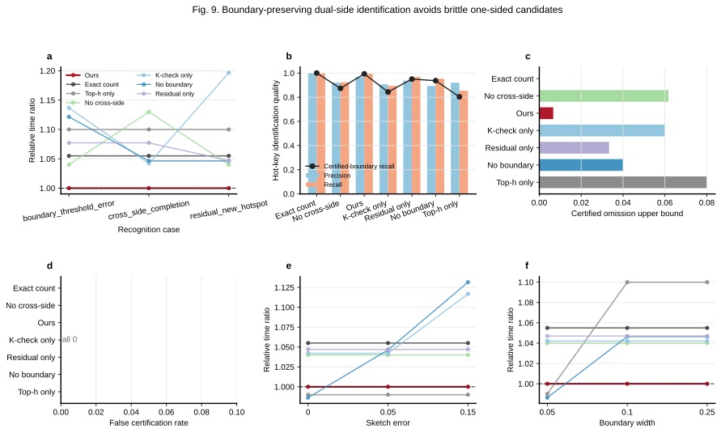

在 12 个共同完成配置上，`Ours K_check Only`、`Top-h Only`、`Exact Full Count`、`Ours Residual Candidate Only`、`Ours w/o Boundary Lookup` 和 `No Cross-Side Completion` 相对完整机制的几何平均相对完成时间比分别为 1.068、1.062、1.055、1.052、1.049 和 1.047。`Exact Full Count` 的 precision 和 recall 均为 1，但需要为完整统计支付额外成本；`Top-h Only` 的 recall 约为 0.853，说明仅依赖固定容量候选会漏掉边界或高工作量键。完整机制的 precision、recall 和 certified-boundary recall 分别约为 0.967、0.993 和 0.993，认证遗漏上界约为 0.0067，并且 `false_certification` 为 0。剩余未被完整识别的边界 case 被标记为证据不足并进入回退路径，没有在证据不充分时错误发布覆盖认证，因此 recall 小于 1 与 `false_certification` 为 0 并不矛盾。

图 9 没有把热点识别准确性写成 join 输出正确性。所有有效结果仍需通过 join 输出检查；机制2的评价对象是当前轮负载事实是否足以支持机制1规划。边界回查带来额外控制成本，但它把“摘要是否足够”转化为可检查条件：当候选覆盖或工作量置信不足时，机制2应返回识别不充分，而不是把未确认键静默归为普通键。

### 8.7 快照驱动的剩余工作再平衡

机制3实验关注初始计划之后的真实执行偏差。该组共享第5章生成的初始任务边界和同一实时所有权协议，只改变运行时供给节点发现与受限探测策略；图 10 展示慢节点扰动下的完成时间、负载离散度、快照路径开销以及 CAS/probe 指标。

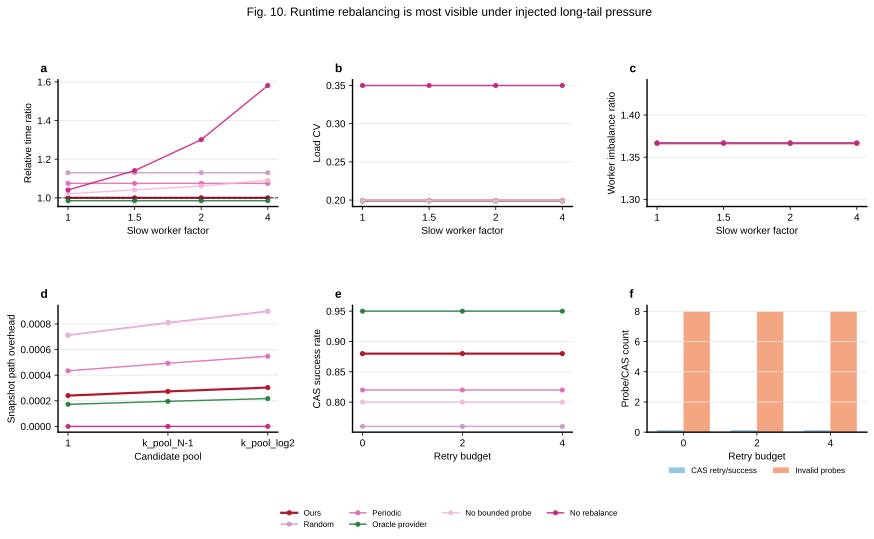

在 16 个共同完成配置上，关闭剩余工作再平衡的 `Ours-No-Rebalance` 相对完整方法的几何平均相对完成时间比为 1.255，`Random Probing` 为 1.130，`Periodic Global Polling` 为 1.075，`Ours w/o Bounded Probing` 为 1.054；`Oracle Provider Selection` 为 0.985。该结果说明，剩余工作再平衡本身是主要收益来源，而快照候选选择进一步减少随机探测和周期性全局轮询带来的低效 provider 发现成本。

图 10d 到图 10f 说明该机制的开销和边界。完整方法的 CAS 成功率约为 0.88，高于 `Random Probing` 的 0.76 和 `Periodic Global Polling` 的 0.82；无效探测数约为 8，低于随机探测的 48、周期轮询的 24 和无界探测版本的 44。`Oracle Provider Selection` 仍略优于完整方法，表明 provider 选择还存在诊断上界；但 oracle 不是可在线获得的信息。快照只用于候选选择，任务所有权仍由实时 `QueueState_i` 和 CAS 确认；过期快照只会造成无效探测，不会决定输出责任。

### 8.8 Profile-scaled workload 与模型稳健性

E7 检查默认合成 workload 之外，主要排序是否仍然成立。该组包含 profile-scaled workload 和 network-cost scale 两类，用于观察结论是否依赖默认热点结构或某一组网络成本参数。图 11 展示外部分布构造 workload 和网络成本缩放下的排序变化。

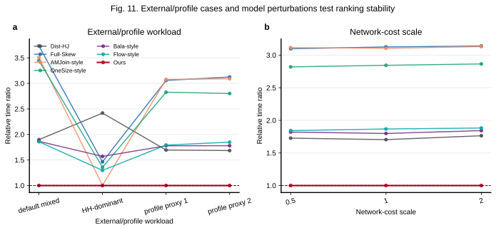

在 7 个共同完成配置上，`Full-SkewJoin`、`AMJoin-style`、`OneSize-style`、`Standard Dist-HJ`、`Bala-Join-style` 和 `Flow-Join-style` 相对 `Ours` 的几何平均相对完成时间比分别为 2.866、2.688、2.622、1.828、1.777 和 1.757，`Ours` 对六类对照均在 7/7 个配置上更短。该结果说明，profile-scaled workload 和网络成本扰动没有改变主要排序；本文方法的收益来自负载决策路径，而不是某一组固定参数的偶然匹配。该组实验不声称已经覆盖真实 RDMA 集群中的所有硬件参数，也不把 profile-scaled 输入等同于原生公开 benchmark。

### 8.9 整机制消融与适用边界

整机制消融用于确认三项机制是否分别覆盖不同阶段的负载均衡问题。该组不比较不同触发场景之间的绝对完成时间，而是在每个触发场景内部比较完整方法与关闭某一机制后的相对完成时间和负载离散度。图 12 对应展示三类触发场景下的整机制消融结果。

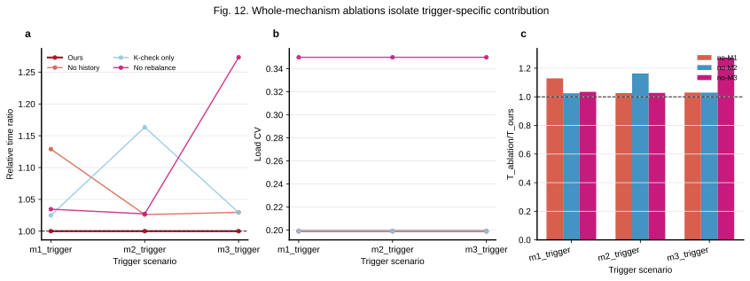

在三类触发场景上，`Ours w/o History Reuse`、`Ours K_check Only` 和 `Ours-No-Rebalance` 相对完整方法的几何平均相对完成时间比分别为 1.061、1.071 和 1.106。该结果说明三项机制并非同一个优化在不同名字下重复出现，而是分别覆盖跨轮历史规划、当前轮双侧负载事实识别和执行期可接管剩余工作的运行时再平衡。

该消融也给出适用边界。某个机制在非目标触发场景下收益较小是预期结果，不应被解释为机制无效。例如，机制3主要在慢节点或初始估计误差导致可接管剩余工作集中时发挥作用；机制1主要在历史状态可验证且当前轮只有局部变化时发挥作用；机制2主要在候选边界和跨侧补全会改变负载事实时发挥作用。因此，本文方法的设计目标不是让每项机制在所有 case 中都显著加速，而是让三项机制分别覆盖不同时间尺度和不同证据来源的负载失衡。

### 8.10 实验小结

实验结果支持三点结论。第一，在大数据区间、资源扩展和多种 workload 形态下，本文方法相对主要倾斜感知对照保持更低的模型估算完成时间，并显著降低负载离散度；但普通哈希连接、Bala-Join-style 和 Flow-Join-style 在部分中小规模或轻量检测足够的配置下仍具有竞争力。第二，机制1、机制2和机制3的收益分别出现在历史状态可验证、当前轮双侧负载事实存在边界风险以及执行期剩余工作形成长尾的场景中，三者对应不同阶段的负载决策问题。第三，profile-scaled workload 和网络成本缩放没有改变主要排序，说明主要结论不依赖单一 workload 形态或固定网络参数。
## 9 结论

本文研究 RDMA 环境下连接键倾斜导致的分布式等值连接负载均衡问题。RDMA 缓解了远端访问和数据交换开销，但不会改变连接键频率分布；随着输入规模扩大，热点键诱导的连接工作和结果输出仍会逐渐主导查询完成时间。本文形成“跨轮历史验证、当前轮双侧负载识别和执行期剩余工作接管”的连续负载决策路径，用于降低重复规划开销、初始负载事实误差和执行期残余长尾。

在统一成本模型下的七方法评估表明，本文方法在大规模倾斜连接中保持更均衡的执行。32x 到 128x 大数据区间内，`Standard Dist-HJ` 相对本文方法的相对完成时间比为 1.57 到 1.95；相对 `Full-SkewJoin`、`AMJoin-style` 和 `OneSize-style` 三类代表性倾斜方法的几何平均相对完成时间比为 1.806 到 2.063。机制实验说明，这一优势分别来自历史验证对重复规划的削减、双侧识别对未确认负载事实的回退保护，以及运行时接管对剩余长尾的纠偏。在中小规模或轻倾斜条件下，普通哈希连接的较低控制成本仍可能更有优势；而在大规模倾斜连接中，本文方法通过跨轮、当前轮和执行期的连续负载决策提供了稳定的负载均衡路径。

## 参考文献

[1] Ahmed Metwally. Scaling Equi-Joins. In *Proceedings of the 2022 International Conference on Management of Data (SIGMOD)*, 2022.

[2] Ahmed Metwally. Scaling and Load-Balancing Equi-Joins. *ACM Transactions on Database Systems*, 50(2), 2025.

[3] Lasse Thostrup, Gloria Doci, Nils Boeschen, Manisha Luthra, Carsten Binnig. Distributed GPU Joins on Fast RDMA-capable Networks. *Proceedings of the ACM on Management of Data*, 1(1), 2023.

[4] Evdokia Kassela, Ioannis Konstantinou, Nectarios Koziris. Accelerating Distributed Repartition Joins on Skewed Datasets via Patch-Based Shuffling. *IEEE Access*, 2025.

[5] Wolf Rödiger, Sam Idicula, Alfons Kemper, Thomas Neumann. Flow-Join: Adaptive Skew Handling for Distributed Joins over High-Speed Networks. In *ICDE*, 2016.

[6] Rundong Li, Mirek Riedewald, Xinyan Deng. Submodularity of Distributed Join Computation. In *SIGMOD*, 2018.

[7] Claude Barthels, Ingo Müller, Timo Schneider, Gustavo Alonso, Torsten Hoefler. Distributed Join Algorithms on Thousands of Cores. *Proceedings of the VLDB Endowment*, 10(5), 2017.

[8] Maximilian Bandle, Jana Giceva, Thomas Neumann. To Partition, or Not to Partition, That is the Join Question in a Real System. In *SIGMOD*, 2021.

[9] Akil Sevim, Ahmed Eldawy, E. Preston Carman Jr., Michael J. Carey, Vassilis J. Tsotras. FUDJ: Flexible User-Defined Distributed Joins. In *ICDE*, 2024.

[10] Jinxin Yang, Hui Li, Wenlong Song, Yiming Si, Hui Zhang, Kankan Zhao, Kewei Wei, Yingfan Liu, Jiangtao Cui. One Size Cannot Fit All: A Self-Adaptive Dispatcher for Skewed Hash Join in Shared-Nothing RDBMSs. In *DASFAA*, 2024.

[11] David Justen, Daniel Ritter, Campbell Fraser, Andrew Lamb, Nga Tran, Allison Lee, Thomas Bodner, Mhd Yamen Haddad, Steffen Zeuch, Volker Markl, Matthias Boehm. POLAR: Adaptive and Non-invasive Join Order Selection via Plans of Least Resistance. *Proceedings of the VLDB Endowment*, 17(6), 2024.

[12] Junyi Zhao, Kai Su, Yifei Yang, Xiangyao Yu, Paraschos Koutris, Huanchen Zhang. Debunking the Myth of Join Ordering: Toward Robust SQL Analytics. *Proceedings of the ACM on Management of Data*, 3(3), 2025.

[13] Prasoon Mishra, V. Krishna Nandivada. COWS for High Performance: Cost Aware Work Stealing for Irregular Parallel Loop. *ACM Transactions on Architecture and Code Optimization*, 21(1), 2024.

[14] Nimar S. Arora, Robert D. Blumofe, C. Greg Plaxton. Thread Scheduling for Multiprogrammed Multiprocessors. In *Proceedings of the 10th ACM Symposium on Parallel Algorithms and Architectures (SPAA)*, 1998.

[15] Shumpei Shiina, Kenjiro Taura. Improving Cache Utilization of Nested Parallel Programs by Almost Deterministic Work Stealing. *IEEE Transactions on Parallel and Distributed Systems*, 33(12), 2022.

[16] Jie Yang, Satish Puri, Hui Zhou. Fine-grained Dynamic Load Balancing in Spatial Join by Work Stealing on Distributed Memory. In *The 30th International Conference on Advances in Geographic Information Systems (SIGSPATIAL)*, 2022.

[17] Fan Zhang, Hanhua Chen, Hai Jin. Simois: A Scalable Distributed Stream Join System with Skewed Workloads. In *Proceedings of the IEEE 39th International Conference on Distributed Computing Systems (ICDCS)*, 2019.

[18] Qing Wang, Youyou Lu, Jiwu Shu. Sherman: A Write-Optimized Distributed B+Tree Index on Disaggregated Memory. In *Proceedings of the 2022 International Conference on Management of Data (SIGMOD)*, 2022.

[19] Zengfeng Huang, Zhongzheng Xiong, Xiaoyi Zhu, Zhewei Wei. Simple and Optimal Algorithms for Heavy Hitters and Frequency Moments in Distributed Models. *arXiv preprint arXiv:2505.14250*, 2025.

[20] Qilong Shi, Xirui Li, Hanyue Zheng, Tong Yang, Yangyang Wang, Mingwei Xu. HeavyLocker: Lock Heavy Hitters in Distributed Data Streams. In *Proceedings of the ACM SIGMOD/PODS International Conference on Management of Data (SIGMOD)*, 2025.

[21] Claude Barthels, Simon Loesing, Gustavo Alonso, Donald Kossmann. Rack-Scale In-Memory Join Processing using RDMA. In *Proceedings of the 2015 ACM SIGMOD International Conference on Management of Data (SIGMOD)*, 2015.

[22] Wolf Rödiger, Tobias Mühlbauer, Alfons Kemper, Thomas Neumann. High-Speed Query Processing over High-Speed Networks. *Proceedings of the VLDB Endowment*, 9(4), 2016.

[23] Feilong Liu, Lingyan Yin, Spyros Blanas. Design and Evaluation of an RDMA-aware Data Shuffling Operator for Parallel Database Systems. In *Proceedings of the Twelfth European Conference on Computer Systems (EuroSys)*, 2017.

[24] Dimitrios Koutsoukos, Ingo Müller, Renato Marroquín, Ana Klimovic, Gustavo Alonso. Modularis: Modular Relational Analytics over Heterogeneous Distributed Platforms. *Proceedings of the VLDB Endowment*, 14(13), 2021.

[25] Matthias Jasny, Lasse Thostrup, Sajjad Tamimi, Andreas Koch, Zsolt István, Carsten Binnig. Zero-sided RDMA: Network-driven Data Shuffling for Disaggregated Heterogeneous Cloud DBMSs. *Proceedings of the ACM on Management of Data*, 2(1), 2024.

[26] Tobias Ziegler, Carsten Binnig, Uwe Röhm. Skew-resilient Query Processing for Fast Networks. In *Datenbanksysteme für Business, Technologie und Web (BTW 2019), Workshopband*, 2019.

[27] Jiaxin Shi, Youyang Yao, Rong Chen, Haibo Chen, Feifei Li. Fast and Concurrent RDF Queries with RDMA-Based Distributed Graph Exploration. In *Proceedings of the 12th USENIX Symposium on Operating Systems Design and Implementation (OSDI)*, 2016.

[28] Cha Hwan Song, Xin Zhe Khooi, Raj Joshi, Inho Choi, Jialin Li, Mun Choon Chan. ConWeave: Network Load Balancing with In-network Reordering Support for RDMA. In *Proceedings of the ACM SIGCOMM Conference*, 2023.

[29] Mubashir Adnan Qureshi, Yuchung Cheng, Qianwen Yin, Qiaobin Fu, Gautam Kumar, Masoud Moshref, Junhua Yan, Van Jacobson, David Wetherall, Abdul Kabbani. PLB: Congestion Signals are Simple and Effective for Network Load Balancing. In *Proceedings of the ACM SIGCOMM Conference*, 2022.

[30] Jie Lu, Jiaqi Gao, Fei Feng, Zhiqiang He, Menglei Zheng, Kun Liu, Jun He, Binbin Liao, Suwei Xu, Ke Sun, Yongjia Mo, Qinghua Peng, Jilie Luo, Qingxu Li, Gang Lu, Zishu Wang, Jianbo Dong, Kunling He, Sheng Cheng, Jiamin Cao, Hairong Jiao, Pengcheng Zhang, Shu Ma, Lingjun Zhu, Chao Shi, Yangming Zhang, Yiquan Chen, Wei Wang, Shuhong Zhu, Xingru Li, Qiang Wang, Jiang Liu, Chao Wang, Wei Lin, Ennan Zhai, Jiesheng Wu, Qiang Liu, Binzhang Fu, Dennis Cai. Alibaba Stellar: A New Generation RDMA Network for Cloud AI. In *Proceedings of the ACM SIGCOMM Conference*, 2025.

[31] Zhihuang Ma, Zichen Xu, Tingyu Li, Zijiang Yang, Xiaoliang Chen, Zuqing Zhu. RDMAX: Scalable RDMA RPC on Reliable Connection Through QP Multiplexing and In-Network Dispatching. *IEEE/ACM Transactions on Networking*, 2025.

[32] Lukas Rupprecht, William Culhane, Peter Pietzuch. SquirrelJoin: Network-Aware Distributed Join Processing with Lazy Partitioning. *Proceedings of the VLDB Endowment*, 10(11), 2017.

[33] Philip W. Frey, Romulo Goncalves, Martin Kersten, Jens Teubner. A Spinning Join that does not get Dizzy. *Proceedings of the VLDB Endowment / VLDB 2009*, 2009.

[34] Abdallah Salama, Carsten Binnig, Tim Kraska, Ansgar Scherp, Tobias Ziegler. Rethinking Distributed Query Execution on High-Speed Networks. *IEEE Data Engineering Bulletin*, 40(1), 2017.

[35] Gustavo Alonso, Carsten Binnig, Ippokratis Pandis, Kenneth Salem, Jan Skrzypczak, Ryan Stutsman, Lasse Thostrup, Tianzheng Wang, Zeke Wang, Tobias Ziegler. DPI: The Data Processing Interface for Modern Networks. In *CIDR*, 2019.

[36] Teng Ma, Tao Ma, Zhuo Song, Jingxuan Li, Huaixin Chang, Kang Chen, Hai Jiang, Yongwei Wu. X-RDMA: Effective RDMA Middleware in Large-scale Production Environments. In *IEEE International Conference on Cluster Computing (CLUSTER)*, 2019.

[37] Dian Shen, Junzhou Luo, Fang Dong, Xiaolin Guo, Ciyuan Chen, Kai Wang, John C. S. Lui. Enabling Distributed and Optimal RDMA Resource Sharing in Large-Scale Data Center Networks: Modeling, Analysis, and Implementation. *IEEE/ACM Transactions on Networking*, 31(6), 2023.

[38] Zichen Zhu, Xiao Hu, Manos Athanassoulis. NOCAP: Near-Optimal Correlation-Aware Partitioning Joins. *Proceedings of the ACM on Management of Data*, 1(1), 2023.

[39] Chao Zhao, Yuxiang Huang, Zhewei Wei, Feifei Li. Double-Anonymous Sketch: Achieving Top-K-fairness for Finding Global Top-K Frequent Items. *Proceedings of the ACM on Management of Data*, 1(1), 2023.

[40] Pengju Liu, Cuiping Li, Hong Chen. Beyond Shuffling: PAC-Tree for Efficient Distributed Joins via Hierarchical Data Placement. *Data Science and Engineering*, 11(1):155-176, 2026.

[41] Panos Parchas, Yaron Naamad, Peter Van Bouwel, Christos Faloutsos, Manos Petropoulos. Fast and Effective Distribution-Key Recommendation for Amazon Redshift. *Proceedings of the VLDB Endowment*, 13(12):2411-2423, 2020.

[42] Jiannan Ding, Umar Farooq Minhas, Badrish Chandramouli, Chao Wang, Yinan Li, Yuliang Li, Donald Kossmann, Johannes Gehrke, Tim Kraska. Instance-Optimized Data Layouts for Cloud Analytics Workloads. In *Proceedings of the 2021 International Conference on Management of Data (SIGMOD)*, 2021.

[43] Zhenyu Li, Man Lung Yiu, Tsz Nam Chan. PAW: Data Partitioning Meets Workload Variance. In *Proceedings of the IEEE 38th International Conference on Data Engineering (ICDE)*, 2022.

[44] Jiaxin Lin, Tao Ji, Xiangpeng Hao, Hokeun Cha, Yanfang Le, Xiangyao Yu, Aditya Akella. Towards Accelerating Data Intensive Application's Shuffle Process Using SmartNICs. *Proceedings of the ACM on Measurement and Analysis of Computing Systems*, 7(2), 2023.

[45] Xiao Hu, Paraschos Koutris. Topology-aware Parallel Joins. *Proceedings of the ACM on Management of Data*, 2(2), 2024.

[46] Mahmoud Abo Khamis, Vasileios Nakos, Dan Olteanu, Dan Suciu. Join Size Bounds using Lp-Norms on Degree Sequences. *Proceedings of the ACM on Management of Data*, 2(2), 2024.

[47] Bruhathi Sundarmurthy, Harshad Deshmukh, Paraschos Koutris, Jeffrey F. Naughton. Salvaging Failing and Straggling Queries. In *Proceedings of the IEEE 38th International Conference on Data Engineering (ICDE)*, 2022.

[48] Maryann Xue, Yingyi Bu, Abhishek Somani, Wenchen Fan, Ziqi Liu, Steven Chen, et al. Adaptive and Robust Query Execution for Lakehouses at Scale. *Proceedings of the VLDB Endowment*, 17(12):3947-3959, 2024.

[49] Ruihong Wang, Jianguo Wang, Stratos Idreos, M. Tamer Ozsu, Walid G. Aref. The Case for Distributed Shared-Memory Databases with RDMA-Enabled Memory Disaggregation. *Proceedings of the VLDB Endowment*, 16(1):15-22, 2022.

[50] Bonaventura Del Monte, Steffen Zeuch, Tilmann Rabl, Volker Markl. Rethinking Stateful Stream Processing with RDMA. In *Proceedings of the 2022 International Conference on Management of Data (SIGMOD)*, 2022.
